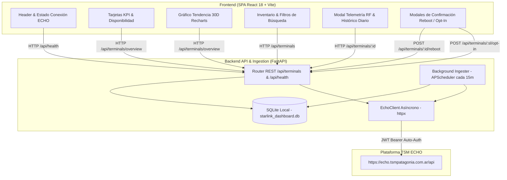

# TSM Starlink Fleet & Usage Monitor

Plataforma integral, moderna y de nivel productivo para el monitoreo en tiempo real, telemetría de radiofrecuencia (RF) y control de consumos de la flota de enlaces satelitales Starlink de **TSM Patagonia**, integrada directamente con la API upstream de **TSM ECHO** (`https://echo.tsmpatagonia.com.ar/api`).

---

## 📋 Tabla de Contenidos

- [Descripción General](#-descripción-general)
- [Arquitectura del Sistema](#-arquitectura-del-sistema)
- [Requisitos Previos](#-requisitos-previos)
- [Instalación y Configuración](#-instalación-y-configuración)
  - [Variables de Entorno (.env)](#variables-de-entorno-env)
  - [Consideraciones en Windows (PowerShell & ExecutionPolicy)](#consideraciones-en-windows-powershell--executionpolicy)
- [Modos de Ejecución](#-modos-de-ejecución)
  - [1. Modo Desarrollo (Local)](#1-modo-desarrollo-local)
  - [2. Despliegue con Docker Compose](#2-despliegue-con-docker-compose)
- [Endpoints de la API](#-endpoints-de-la-api)
- [Suite de Pruebas Automatizadas](#-suite-de-pruebas-automatizadas)
- [Estructura del Repositorio](#-estructura-del-repositorio)
- [Documentación Técnica Adicional](#-documentación-técnica-adicional)
- [Licencia](#-licencia)

---

## 🛰️ Descripción General

El **TSM Starlink Fleet & Usage Monitor** es una solución Full-Stack diseñada para resolver la supervisión centralizada de terminales satelitales Starlink. A través de una integración automatizada con la plataforma TSM ECHO, el sistema recolecta inventario, telemetría de radiofrecuencia (RF), ciclos de facturación vigentes y desgloses diarios de consumo de datos.

### Capacidades Destacadas:
- **Monitoreo de Flota Unificado**: Visualización del estado en línea/fuera de línea, latencia de ping, fluctuación de throughput de bajada/subida y calidad de señal.
- **Auditoría de Consumo y Cuotas**: Cálculo dinámico del volumen de datos transferido mensual versus la cuota contratada (*Priority*, *Standard* y *Opt-In*), con alertas tempranas para enlaces que alcanzan el 80% y el 100% del umbral de servicio.
- **Acciones Operativas Seguras**: Ejecución remota de reinicios de terminal (*reboot*) y conmutación de política de sobreconsumo prioritario (*Data Opt-In / Opt-Out*) con doble confirmación interactiva.
- **Resiliencia Operativa y Offline-First**: Ingesta persistida en SQLite local mediante SQLAlchemy 2.0. En caso de corte o interrupción con el backend de TSM ECHO, el dashboard sigue respondiendo con el último snapshot histórico sin degradar la experiencia de usuario.

---

## 🏛️ Arquitectura del Sistema

El sistema implementa una arquitectura desacoplada y reactiva:



### Stack Tecnológico:
- **Backend**: Python 3.11+ / 3.14 con [FastAPI](https://fastapi.tiangolo.com/), [SQLAlchemy 2.0](https://www.sqlalchemy.org/), [HTTPX](https://www.python-httpx.org/), [APScheduler](https://apscheduler.readthedocs.io/) y [Pydantic v2](https://docs.pydantic.dev/).
- **Frontend**: [React 18](https://react.dev/) + [Vite](https://vitejs.dev/) + [Tailwind CSS v3](https://tailwindcss.com/) + [Lucide Icons](https://lucide.dev/) + [Recharts](https://recharts.org/).
- **Persistencia**: [SQLite3](https://www.sqlite.org/) con soporte multihilo (`check_same_thread=False`).
- **Contenedores**: [Docker](https://www.docker.com/) multi-etapa y [Docker Compose](https://docs.docker.com/compose/).

---

## 📦 Requisitos Previos

Para ejecutar la aplicación localmente en modo desarrollo, se requieren:
- **Python**: Versión 3.11 o superior (compatible con Python 3.14 y gestores como `uv` o `pip`).
- **Node.js**: Versión 18.x o superior (con `npm` 9+).
- **Docker & Docker Compose**: (Opcional) Requerido únicamente para ejecución contenerizada.

---

## ⚙️ Instalación y Configuración

### Variables de Entorno (.env)

Copia el archivo de plantilla `.env.example` en la raíz del proyecto para crear tu archivo `.env`:

```bash
# En sistemas Unix / macOS:
cp .env.example .env

# En Windows PowerShell / CMD:
copy .env.example .env
```

Edita el archivo `.env` configurando los parámetros requeridos:

```env
# URL base de la API interna de TSM ECHO
ECHO_BASE_URL=https://echo.tsmpatagonia.com.ar/api

# Credenciales de acceso a la plataforma TSM ECHO
ECHO_EMAIL=tu_usuario@empresa.com.ar
ECHO_PASSWORD=tu_contraseña_segura

# Cadencia de sincronización en segundo plano (minutos)
SYNC_INTERVAL_MINUTES=15

# Cadena de conexión a base de datos (SQLite por defecto)
DATABASE_URL=sqlite:///./starlink_dashboard.db

# Configuración del servidor backend
PORT=8000
HOST=0.0.0.0
```

> [!NOTE]
> Si no configuras `ECHO_EMAIL` y `ECHO_PASSWORD`, el backend levantará automáticamente en **Modo Demostración / Caché Local**, inicializando 8 terminales satelitales simuladas con telemetría realista e historial diario de consumo para pruebas. En cuanto ingreses credenciales válidas, el sistema purgará los datos de demostración y sincronizará la flota real.

### Consideraciones en Windows (PowerShell & ExecutionPolicy)

En sistemas operativos Windows, las políticas de seguridad predeterminadas de PowerShell (`Restricted`) pueden bloquear la ejecución de scripts `.ps1` como `npm.ps1` o la activación de entornos virtuales (`Activate.ps1`).

**Soluciones recomendadas:**

1. **Uso explícito de `npm.cmd`**:
   Ejecuta comandos npm especificando la extensión ejecutable por lotes:
   ```powershell
   npm.cmd run dev:frontend
   ```
2. **Habilitar ejecución de scripts firmados para el usuario actual**:
   Abre una consola PowerShell y ejecuta:
   ```powershell
   Set-ExecutionPolicy -ExecutionPolicy RemoteSigned -Scope CurrentUser
   ```
3. **Uso del Command Prompt tradicional (`cmd.exe`)**:
   ```cmd
   cmd.exe /c "npm run dev:frontend"
   ```

---

## 🚀 Modos de Ejecución

### 1. Modo Desarrollo (Local)

#### Paso 1: Configurar entorno del Backend
```bash
# Crear entorno virtual con Python
python -m venv backend/.venv

# O mediante uv (ultrarrápido):
uv venv backend/.venv

# Instalar dependencias del backend
backend\.venv\Scripts\pip.exe install -r backend/requirements.txt
```

#### Paso 2: Iniciar el servidor Backend (FastAPI)
```bash
# Ejecutar Uvicorn directamente:
backend\.venv\Scripts\python.exe -m uvicorn backend.app.main:app --host 0.0.0.0 --port 8000 --reload

# O mediante atajo npm:
npm.cmd run dev:backend
```
El servidor backend quedará disponible en:
- **API Base**: `http://localhost:8000`
- **Documentación Interactiva (Swagger UI)**: `http://localhost:8000/docs`
- **Documentación ReDoc**: `http://localhost:8000/redoc`
- **Chequeo de Salud**: `http://localhost:8000/api/health`

#### Paso 3: Iniciar el servidor Frontend (Vite + React)
En una segunda consola terminal:
```bash
cd frontend
npm.cmd install
npm.cmd run dev

# O directamente desde la raíz del proyecto:
npm.cmd run dev:frontend
```
El panel de control interactivo estará disponible en: **`http://localhost:5173`**.

> [!TIP]
> Vite incluye un proxy inverso configurado en `frontend/vite.config.js` que redirige de forma transparente todas las peticiones con prefijo `/api` hacia `http://127.0.0.1:8000`, evitando problemas de CORS durante el desarrollo.

---

### 2. Despliegue con Docker Compose

Para ejecutar la solución completa en contenedores aislados y optimizados para producción:

```bash
# Construir y levantar los contenedores en segundo plano
docker compose up -d --build
```

Servicios desplegados:
- **`tsm-starlink-frontend`**: Servidor Nginx sirviendo la SPA compilada en el puerto `3000` y proxificando llamadas `/api/` al backend.
- **`tsm-starlink-backend`**: Contenedor FastAPI Python 3.11 en el puerto `8000` con SQLite mapeado a un volumen persistente.

Para verificar el estado de los servicios:
```bash
docker compose ps
docker compose logs -f
```

Para detener los servicios:
```bash
docker compose down
```

---

## 📡 Endpoints de la API

| Método | Endpoint | Parámetros / Payload | Descripción |
| :--- | :--- | :--- | :--- |
| `GET` | `/api/health` | Ninguno | Estado general del sistema, conexión a SQLite y conectividad ECHO |
| `GET` | `/api/sync-logs` | Ninguno | Historial de las últimas 20 ejecuciones del worker de sincronización |
| `GET` | `/api/terminals/overview` | Ninguno | Resumen consolidado: métricas KPI, tendencia global de 30 días y flota |
| `GET` | `/api/terminals` | `?status=online\|offline&search=...` | Listado de terminales con filtros por conectividad o texto |
| `GET` | `/api/terminals/{id}` | `id` (device_id o id interno) | Ficha técnica y telemetría de RF en tiempo real del terminal |
| `GET` | `/api/terminals/{id}/usage-history`| `id` (device_id) | Historial diario estructurado de consumo para gráficos Recharts |
| `POST`| `/api/terminals/{id}/reboot` | `id` (device_id) | Dispara orden de reinicio remoto de la antena vía Starlink Backoffice |
| `POST`| `/api/terminals/{sl}/opt-in` | `sl` (service_line_number), `?enabled=bool` | Conmuta política de sobreconsumo prioritario (Opt-In / Opt-Out) |
| `POST`| `/api/terminals/sync` | Ninguno | Dispara sincronización forzada e inmediata contra TSM ECHO |

Consulta la referencia detallada de endpoints con ejemplos en [`docs/API_REFERENCE.md`](file:///c:/antigravity/tsmpatagonia/docs/API_REFERENCE.md).

---

## 🧪 Suite de Pruebas Automatizadas

El proyecto cuenta con scripts de validación integral que verifican la base de datos, los modelos ORM, el cliente HTTP y los endpoints REST:

```bash
# Validar capa de base de datos y sincronizador
backend\.venv\Scripts\python.exe backend/test_backend.py

# Validar suite completa de endpoints REST FastAPI
backend\.venv\Scripts\python.exe backend/test_api_endpoints.py

# O ejecutar mediante npm:
npm.cmd run test:backend
```

Para validar la compilación limpia del Frontend:
```bash
cd frontend
npm.cmd run build
```

---

## 📁 Estructura del Repositorio

```text
tsmpatagonia/
├── backend/                        # Núcleo del servidor y servicios Python
│   ├── app/
│   │   ├── core/
│   │   │   ├── config.py           # Configuración tipada con Pydantic Settings
│   │   │   └── database.py         # Sesión SQLAlchemy y motor SQLite
│   │   ├── models/
│   │   │   └── terminal.py         # Modelos ORM (Terminal, BillingCycle, DailyUsage, SyncLog)
│   │   ├── schemas/
│   │   │   └── terminal.py         # Esquemas de entrada/salida Pydantic v2
│   │   ├── services/
│   │   │   ├── echo_client.py      # Cliente HTTP asíncrono httpx contra TSM ECHO
│   │   │   ├── sync_service.py     # Lógica de ingesta, saneamiento y demo seed
│   │   │   └── scheduler.py        # Worker de sincronización periódica APScheduler
│   │   ├── routers/
│   │   │   ├── terminals.py        # Controladores REST de flota, KPIs y acciones
│   │   │   └── health.py           # Endpoint de salud y logs de sincronización
│   │   └── main.py                 # Aplicación FastAPI, middleware CORS y ciclo de vida
│   ├── Dockerfile                  # Empaquetado Docker para Backend
│   ├── requirements.txt            # Dependencias Python
│   ├── test_backend.py             # Prueba unitaria del motor y modelos
│   └── test_api_endpoints.py       # Prueba de integración de endpoints REST
├── frontend/                       # Aplicación SPA React 18
│   ├── src/
│   │   ├── components/
│   │   │   ├── Header.jsx          # Barra superior, branding y sincronización manual
│   │   │   ├── KpiCards.jsx        # 4 tarjetas de métricas críticas y alarmas
│   │   │   ├── FleetChart.jsx      # Gráfico de área apilado (30 días de flota)
│   │   │   ├── TerminalTable.jsx   # Tabla de inventario, buscador y badges
│   │   │   ├── TerminalDetailModal.jsx # Telemetría RF y barras de consumo diario
│   │   │   └── ActionConfirmModal.jsx  # Modal de confirmación para Reboot y Opt-In
│   │   ├── App.jsx                 # Estado global, polling automático y vista principal
│   │   ├── index.css               # Estilos globales, Tailwind v3 y glassmorphism
│   │   └── main.jsx                # Montaje de React DOM
│   ├── Dockerfile                  # Empaquetado Docker multi-etapa con Nginx
│   ├── nginx.conf                  # Configuración de Nginx para SPA y proxy inverso
│   ├── package.json                # Dependencias de Node.js del frontend
│   ├── tailwind.config.js          # Configuración de diseño y paleta de colores
│   └── vite.config.js              # Configuración de Vite con proxy /api
├── docs/                           # Suite de Documentación Técnica y Operativa
│   ├── ARCHITECTURE.md             # Arquitectura de software, flujos y modelo de datos
│   ├── API_REFERENCE.md            # Referencia exhaustiva de endpoints y payloads
│   └── DEPLOYMENT.md               # Guía de producción, reverse proxies, SSL y backups
├── docker-compose.yml              # Orquestación de contenedores Frontend + Backend
├── Makefile                        # Atajos de terminal Make para Linux/macOS
├── package.json                    # Atajos de npm unificados en la raíz
├── starlink_api_docs.md            # Especificación inversa de la API interna de ECHO
├── implementation_plan.md          # Plan y seguimiento de hitos de desarrollo
├── walkthrough.md                  # Bitácora de validaciones y verificación operativa
└── README.md                       # Documento principal del repositorio
```

---

## 📚 Documentación Técnica Adicional

Para profundizar en el diseño e ingeniería del proyecto, consulta los documentos de la suite:
- [Arquitectura de Software y Ciclo de Vida JWT](file:///c:/antigravity/tsmpatagonia/docs/ARCHITECTURE.md)
- [Referencia Completa de la API](file:///c:/antigravity/tsmpatagonia/docs/API_REFERENCE.md)
- [Guía de Despliegue en Producción y Seguridad](file:///c:/antigravity/tsmpatagonia/docs/DEPLOYMENT.md)
- [Especificación Reversa de TSM ECHO API](file:///c:/antigravity/tsmpatagonia/starlink_api_docs.md)

---

## 📄 Licencia

Desarrollado para **TSM Patagonia**. Todos los derechos reservados.
