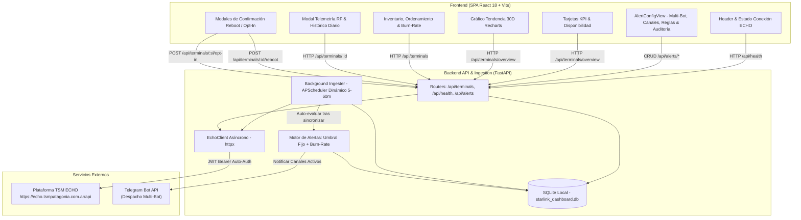
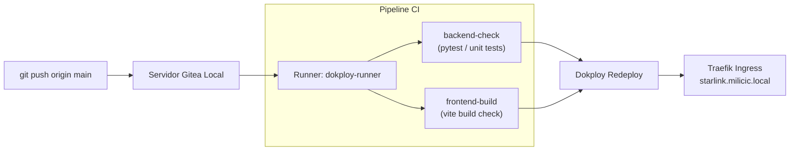

# Starlink Fleet & Usage Monitor (Milicic / TSM Patagonia)

Plataforma integral, moderna y de nivel productivo para el monitoreo en tiempo real, telemetría de radiofrecuencia (RF) y control de consumos de la flota de enlaces satelitales Starlink de **Milicic / TSM Patagonia**, integrada directamente con la API upstream de **TSM ECHO** (`https://echo.tsmpatagonia.com.ar/api`).

Diseñada bajo el sistema visual corporativo de **Milicic**, automatizada mediante **Gitea Actions CI/CD** y orquestada para despliegue continuo en **Dokploy** con enrutamiento dinámico vía **Traefik**.

---

## 📋 Tabla de Contenidos

- [Descripción General](#-descripción-general)
- [Arquitectura del Sistema](#-arquitectura-del-sistema)
- [Identidad Visual y Diseño (Milicic UI)](#-identidad-visual-y-diseño-milicic-ui)
- [Requisitos Previos](#-requisitos-previos)
- [Instalación y Configuración Local](#-instalación-y-configuración-local)
  - [Variables de Entorno (.env)](#variables-de-entorno-env)
  - [Consideraciones en Windows (PowerShell & ExecutionPolicy)](#consideraciones-en-windows-powershell--executionpolicy)
- [Modos de Ejecución](#-modos-de-ejecución)
  - [1. Modo Desarrollo (Local)](#1-modo-desarrollo-local)
  - [2. Despliegue con Docker Compose](#2-despliegue-con-docker-compose)
- [Despliegue Continuo con Dokploy & Traefik](#-despliegue-continuo-con-dokploy--traefik)
- [Pipeline de CI/CD con Gitea Actions](#-pipeline-de-cicd-con-gitea-actions)
- [Seguridad y Gestión de Secretos](#-seguridad-y-gestión-de-secretos)
- [Endpoints de la API](#-endpoints-de-la-api)
- [Suite de Pruebas Automatizadas](#-suite-de-pruebas-automatizadas)
- [Estructura del Repositorio](#-estructura-del-repositorio)
- [Documentación Técnica Adicional](#-documentación-técnica-adicional)
- [Licencia](#-licencia)

---

## 🛰️ Descripción General

El **TSM Starlink Fleet & Usage Monitor** es una solución Full-Stack diseñada para resolver la supervisión centralizada de terminales satelitales Starlink. A través de una integración automatizada con la plataforma TSM ECHO, el sistema recolecta inventario, telemetría de radiofrecuencia (RF), ciclos de facturación vigentes y desgloses diarios de consumo de datos.

### Capacidades Destacadas:
- **Monitoreo de Flota Unificado**: Visualización del estado en línea/fuera de línea, latencia de ping, fluctuación de throughput de bajada/subida y calidad de señal.
- **Interactividad y Ordenamiento Multimétrica**: Tabla reactiva con ordenamiento ascendente/descendente configurable por cualquier métrica clave: consumo (GB / %), throughput instantáneo, latencia de ping, días restantes de ciclo y estado del terminal.
- **Silenciamiento Individual de Terminales**: Control granular (`alerts_enabled`) para pausar notificaciones en antenas en mantenimiento programado o traslados sin afectar al resto de la flota.
- **Motor de Alertas Inteligente con Criterio de Cuota, Burn-Rate y Tolerancia**:
  - *Regla 1 (Umbral Fijo)*: Alerta al superar porcentajes configurables de cuota mensual (ej. 80%, 100%).
  - *Regla 2 (Burn-Rate / Alerta Temprana)*: Detección inteligente de ritmo acelerado de consumo que agotará el paquete antes del cierre de ciclo (evalúa `% consumido` vs `días restantes del ciclo`).
  - *Regla 3 (Caídas Offline con Tolerancia Sostenida de 15 Minutos)*: Filtro anti-falsos positivos diseñado para zonas remotas y cordilleranas (Veladero, Sierra Grande, Barda del Medio). Descarta micro-cortes transitorios (<15m) por conmutación orbital o ráfagas de viento y solo notifica si la caída es ininterrumpida.
  - *Regla 4 (Aviso de Restablecimiento / Recovery Online)*: Alerta automática en verde que confirma la recuperación del enlace y reporta la duración total de la caída y la latencia recuperada.
  - *Ventana de Cooldown Anti-Spam*: Evita alertas repetitivas mediante enfriamiento configurable por terminal (por defecto 24 horas).
  - *Cadencia Parametrizable en Caliente*: Frecuencia de sincronización y evaluación ajustable dinámicamente (5 a 60 minutos) sin reiniciar servicios.
- **Arquitectura Multi-Bot y Notificaciones en Telegram**:
  - Gestión simultánea de múltiples bots de Telegram corporativos con validación criptográfica en vivo (`getMe`) y enmascaramiento de tokens.
  - Canales y grupos destinatarios vinculados a bots específicos con activación/pausa individual.
  - **Prueba de Canal con Alertas Reales**: Botón para evaluar la flota en el momento exacto y despachar todas las alertas vigentes al canal, omitiendo el cooldown para una validación fidedigna de guardia.
  - Historial persistido de incidencias y entregas en base de datos.
- **Acciones Operativas Seguras**: Ejecución remota de reinicios de terminal (*reboot*) y conmutación de política de sobreconsumo prioritario (*Data Opt-In / Opt-Out*) con doble confirmación interactiva.
- **Resiliencia Operativa y Offline-First**: Ingesta persistida en SQLite local mediante SQLAlchemy 2.0. En caso de corte o interrupción con el backend de TSM ECHO, el dashboard sigue respondiendo con el último snapshot histórico sin degradar la experiencia de usuario.

---

## 🏛️ Arquitectura del Sistema

El sistema implementa una arquitectura desacoplada y reactiva:



### Stack Tecnológico:
- **Backend**: Python 3.11+ / 3.14 con [FastAPI](https://fastapi.tiangolo.com/), [SQLAlchemy 2.0](https://www.sqlalchemy.org/), [HTTPX](https://www.python-httpx.org/), [APScheduler](https://apscheduler.readthedocs.io/) y [Pydantic v2](https://docs.pydantic.dev/).
- **Frontend**: [React 18](https://react.dev/) + [Vite](https://vitejs.dev/) + [Tailwind CSS v3](https://tailwindcss.com/) + [Lucide Icons](https://lucide.dev/) + [Recharts](https://recharts.org/).
- **Sistema de Diseño**: **Milicic UI Design System** con paleta corporativa (Naranja Constructora, Dark Pizarra, Canvas `#0F141A`).
- **Persistencia**: [SQLite3](https://www.sqlite.org/) con soporte multihilo (`check_same_thread=False`) en volumen persistente `starlink_data`.
- **Infraestructura & Despliegue**: [Docker Compose](https://docs.docker.com/compose/), [Dokploy](https://dokploy.com/), [Traefik v3](https://traefik.io/) y [Gitea Actions](https://docs.gitea.com/usage/actions/overview).

---

## 🎨 Identidad Visual y Diseño (Milicic UI)

La interfaz fue construida siguiendo los estándares de diseño corporativo de **Milicic S.A.**:

- **Paleta de Colores Corporativa**:
  - **Naranja Constructora (Primario)**: `#F39200` (Hover: `#D98200`, Active: `#BF7300`).
  - **Dark Canvas (Fondo)**: `#0F141A` (Gris carbón profundo con tinte azulado).
  - **Dark Surface (Tarjetas)**: `#1A222B` (Superficie elevada con bordes `#2A3441`).
  - **Pizarra / Acentos Neutros**: `#4B5563` a `#1F2937`.
  - **Estados Operativos**: Verde Éxito (`#10B981`), Rojo Crítico (`#EF4444`), Ámbar Advertencia (`#F59E0B`).
- **Componentes y Elementos Visuales**:
  - `MilicicLogo.jsx`: Isologotipo corporativo oficial con isotipo de franjas y texto "FLEET MONITOR".
  - `Toast.jsx`: Notificaciones interactivas de éxito, error y advertencia en tiempo real.
  - `ActionConfirmModal.jsx`: Modal modal de confirmación con doble validación visual para reboot y opt-in.
  - Micro-animaciones y bordes refinados con efectos glassmorphism modernos.

---

## 📦 Requisitos Previos

Para ejecutar la aplicación localmente en modo desarrollo, se requieren:
- **Python**: Versión 3.11 o superior (compatible con Python 3.14 y gestores como `uv` o `pip`).
- **Node.js**: Versión 18.x o superior (con `npm` 9+).
- **Docker & Docker Compose**: (Opcional) Requerido únicamente para ejecución contenerizada.

---

## ⚙️ Instalación y Configuración

### Variables de Entorno (.env)

Copia el archivo de plantilla `.env.example` en la raíz del proyecto para crear tu archivo `.env`:

```bash
# En sistemas Unix / macOS:
cp .env.example .env

# En Windows PowerShell / CMD:
copy .env.example .env
```

Edita el archivo `.env` configurando los parámetros requeridos:

```env
# URL base de la API interna de TSM ECHO
ECHO_BASE_URL=https://echo.tsmpatagonia.com.ar/api

# Credenciales de acceso a la plataforma TSM ECHO
ECHO_EMAIL=tu_usuario@empresa.com.ar
ECHO_PASSWORD=tu_contraseña_segura

# Cadencia de sincronización en segundo plano (minutos)
SYNC_INTERVAL_MINUTES=15

# Cadena de conexión a base de datos (SQLite por defecto)
DATABASE_URL=sqlite:///./starlink_dashboard.db

# Configuración del servidor backend
PORT=8000
HOST=0.0.0.0
```

> [!NOTE]
> Si no configuras `ECHO_EMAIL` y `ECHO_PASSWORD`, el backend levantará automáticamente en **Modo Demostración / Caché Local**, inicializando 8 terminales satelitales simuladas con telemetría realista e historial diario de consumo para pruebas. En cuanto ingreses credenciales válidas, el sistema purgará los datos de demostración y sincronizará la flota real.

### Consideraciones en Windows (PowerShell & ExecutionPolicy)

En sistemas operativos Windows, las políticas de seguridad predeterminadas de PowerShell (`Restricted`) pueden bloquear la ejecución de scripts `.ps1` como `npm.ps1` o la activación de entornos virtuales (`Activate.ps1`).

**Soluciones recomendadas:**

1. **Uso explícito de `npm.cmd`**:
   Ejecuta comandos npm especificando la extensión ejecutable por lotes:
   ```powershell
   npm.cmd run dev:frontend
   ```
2. **Habilitar ejecución de scripts firmados para el usuario actual**:
   Abre una consola PowerShell y ejecuta:
   ```powershell
   Set-ExecutionPolicy -ExecutionPolicy RemoteSigned -Scope CurrentUser
   ```
3. **Uso del Command Prompt tradicional (`cmd.exe`)**:
   ```cmd
   cmd.exe /c "npm run dev:frontend"
   ```

---

## 🚀 Modos de Ejecución

### 1. Modo Desarrollo (Local)

#### Paso 1: Configurar entorno del Backend
```bash
# Crear entorno virtual con Python
python -m venv backend/.venv

# O mediante uv (ultrarrápido):
uv venv backend/.venv

# Instalar dependencias del backend
backend\.venv\Scripts\pip.exe install -r backend/requirements.txt
```

#### Paso 2: Iniciar el servidor Backend (FastAPI)
```bash
# Ejecutar Uvicorn directamente:
backend\.venv\Scripts\python.exe -m uvicorn backend.app.main:app --host 0.0.0.0 --port 8000 --reload

# O mediante atajo npm:
npm.cmd run dev:backend
```
El servidor backend quedará disponible en:
- **API Base**: `http://localhost:8000`
- **Documentación Interactiva (Swagger UI)**: `http://localhost:8000/docs`
- **Documentación ReDoc**: `http://localhost:8000/redoc`
- **Chequeo de Salud**: `http://localhost:8000/api/health`

#### Paso 3: Iniciar el servidor Frontend (Vite + React)
En una segunda consola terminal:
```bash
cd frontend
npm.cmd install
npm.cmd run dev

# O directamente desde la raíz del proyecto:
npm.cmd run dev:frontend
```
El panel de control interactivo estará disponible en: **`http://localhost:5173`**.

> [!TIP]
> Vite incluye un proxy inverso configurado en `frontend/vite.config.js` que redirige de forma transparente todas las peticiones con prefijo `/api` hacia `http://127.0.0.1:8000`, evitando problemas de CORS durante el desarrollo.

---

### 2. Despliegue con Docker Compose

La solución está completamente contenerizada y lista para producción mediante [docker-compose.yml](file:///c:/antigravity/tsmpatagonia/docker-compose.yml):

```bash
# Construir y levantar los contenedores en segundo plano
docker compose up -d --build
```

Servicios orquestados:
- **`tsm_starlink_frontend`**: Servidor Nginx que sirve la SPA React compilada en el puerto interno `80` y redirige el tráfico `/api/` hacia el backend.
- **`tsm_starlink_backend`**: Contenedor FastAPI (Python 3.11) en el puerto interno `8000`, conectado al volumen persistente `starlink_data`.
- **Red Docker**: Se integran a la red `dokploy-network` (o `bridge` por defecto en entornos independientes).

Comandos de gestión:
```bash
# Ver estado de los contenedores
docker compose ps

# Inspeccionar logs en vivo
docker compose logs -f

# Detener los servicios
docker compose down
```

---

## 🚀 Despliegue Continuo con Dokploy & Traefik

El proyecto está configurado para desplegarse automáticamente sobre **Dokploy** utilizando **Traefik v3** como Reverse Proxy:

### 1. Configuración de Red y Enrutamiento Traefik
En `docker-compose.yml`, el servicio `frontend` declara las etiquetas directas de Traefik para conectarse a la red externa `dokploy-network`:

```yaml
    labels:
      - "traefik.enable=true"
      - "traefik.http.routers.starlink-frontend.rule=Host(`starlink.milicic.local`)"
      - "traefik.http.services.starlink-frontend.loadbalancer.server.port=80"
      - "traefik.docker.network=dokploy-network"
```

> [!IMPORTANT]
> **Bypass de Validación DNS de Dokploy UI**:
> En entornos locales, VPN o redes corporativas privadas (donde el host se accede mediante una IP interna como `172.27.210.154` que difiere de la IP detectada en `eth0`), la interfaz web de Dokploy bloquea la activación de dominios por discrepancia de DNS.
> Al declarar las etiquetas nativas de Traefik en `docker-compose.yml`, Traefik lee las reglas directamente desde `/var/run/docker.sock`, enrutando el dominio **`http://starlink.milicic.local`** de manera instantánea y sin requerir la validación de la interfaz de Dokploy.

### 2. Acceso al Servicio
- **URL Productiva**: [http://starlink.milicic.local](http://starlink.milicic.local)
- **Resolución Local**: Asegúrate de tener configurada la entrada en el archivo `hosts` de tu máquina cliente:
  ```text
  172.27.210.154  starlink.milicic.local
  ```

---

## 🔄 Pipeline de CI/CD con Gitea Actions

El repositorio integra integración continua automatizada a través de **Gitea Actions** ([.gitea/workflows/ci.yaml](file:///c:/antigravity/tsmpatagonia/.gitea/workflows/ci.yaml)):

### Estructura del Pipeline
Cada `push` o `pull_request` a la rama `main` ejecuta en paralelo:

1. **`backend-check` (FastAPI + SQLite)**:
   - Configura entorno Python 3.11 en el runner `dokploy-runner`.
   - Instala dependencias (`requirements.txt`).
   - Ejecuta `backend/test_backend.py` (modelos ORM, transacciones e ingesta).
   - Ejecuta `backend/test_api_endpoints.py` (cobertura completa de endpoints REST).
2. **`frontend-build` (React 18 + Vite)**:
   - Configura Node.js 18.x.
   - Instala paquetes vía `npm ci`.
   - Valida la compilación estricta de producción (`npm run build`).



---

## 🔐 Seguridad y Gestión de Secretos

Para garantizar la seguridad de las credenciales de la plataforma TSM ECHO y los accesos de infraestructura:

1. **Aislamiento de `.env`**:
   - El archivo `.env` se encuentra estrictamente excluido del repositorio mediante `.gitignore`. Nunca debe incluirse en commits.
2. **Inyección en Dokploy**:
   - En producción, las variables sensibles (`ECHO_PASSWORD`, `DATABASE_URL`, etc.) se configuran exclusivamente en la pestaña **Environment Variables** de la aplicación en Dokploy.
3. **Protección de Datos Locales (SQLite)**:
   - Los archivos de base de datos (`*.db`, `*.sqlite`) están excluidos de Git para evitar filtrar telemetría interna o generar conflictos binarios en el historial.
   - En producción, la persistencia se garantiza mediante el volumen nombrado de Docker `starlink_data`.
4. **Comandos Críticos con Confirmación Explícita**:
   - Las órdenes de reinicio (*Reboot*) y cambio de cuota (*Data Opt-In*) requieren confirmación en modal con alertas visuales de impacto operacional.

---

## 📡 Endpoints de la API

### Flota y Telemetría
| Método | Endpoint | Parámetros / Payload | Descripción |
| :--- | :--- | :--- | :--- |
| `GET` | `/api/health` | Ninguno | Estado general del sistema, conexión a SQLite y conectividad ECHO |
| `GET` | `/api/sync-logs` | Ninguno | Historial de las últimas 20 ejecuciones del worker de sincronización |
| `GET` | `/api/terminals/overview` | Ninguno | Resumen consolidado: métricas KPI, tendencia global de 30 días y flota |
| `GET` | `/api/terminals` | `?status=online\|offline&search=...` | Listado de terminales con filtros por conectividad o texto |
| `GET` | `/api/terminals/{id}` | `id` (device_id o id interno) | Ficha técnica y telemetría de RF en tiempo real del terminal |
| `GET` | `/api/terminals/{id}/usage-history`| `id` (device_id) | Historial diario estructurado de consumo para gráficos Recharts |
| `POST`| `/api/terminals/{id}/reboot` | `id` (device_id) | Dispara orden de reinicio remoto de la antena vía Starlink Backoffice |
| `POST`| `/api/terminals/{sl}/opt-in` | `sl` (service_line_number), `?enabled=bool` | Conmuta política de sobreconsumo prioritario (Opt-In / Opt-Out) |
| `POST`| `/api/terminals/{id}/toggle-alerts`| `id` (device_id o id interno) | Activa o silencia individualmente las alertas para un terminal |
| `POST`| `/api/terminals/sync` | Ninguno | Dispara sincronización forzada e inmediata contra TSM ECHO |

### Motor de Alertas & Telegram Multi-Bot
| Método | Endpoint | Parámetros / Payload | Descripción |
| :--- | :--- | :--- | :--- |
| `GET` | `/api/alerts/config` | Ninguno | Obtiene la configuración de umbrales, cadencia y cooldown |
| `PUT` | `/api/alerts/config` | `AlertConfigUpdate` (JSON) | Actualiza umbrales de cuota, cadencia dinámica y cooldown |
| `GET` | `/api/alerts/bots` | Ninguno | Lista los bots de Telegram configurados con tokens enmascarados |
| `POST`| `/api/alerts/bots` | `TelegramBotCreate` (JSON) | Registra un nuevo bot con validación oficial previa `getMe` |
| `PUT` | `/api/alerts/bots/{id}` | `TelegramBotUpdate` (JSON) | Modifica o conmuta el bot predeterminado |
| `DELETE`| `/api/alerts/bots/{id}`| `id` (entero) | Elimina un bot y reasigna canales al bot por defecto |
| `POST`| `/api/alerts/verify-bot` | `VerifyBotRequest` (JSON) | Valida en caliente un token contra la API de Telegram |
| `GET` | `/api/alerts/channels` | Ninguno | Lista canales y grupos de Telegram con su bot emisor asociado |
| `POST`| `/api/alerts/channels` | `TelegramChannelCreate` (JSON) | Registra un nuevo canal vinculándolo a un bot específico |
| `PUT` | `/api/alerts/channels/{id}` | `TelegramChannelUpdate` (JSON) | Modifica bot asignado o conmuta estado (activo/pausado) |
| `DELETE`| `/api/alerts/channels/{id}`| `id` (entero) | Elimina un canal de la lista de destinatarios |
| `POST`| `/api/alerts/test-telegram` | `TestTelegramRequest` (JSON) | Envía mensaje simple de prueba de conectividad |
| `POST`| `/api/alerts/channels/{id}/test-real-alerts` | `id` (entero) | **Evalúa la flota en vivo y despacha las alertas vigentes al canal** |
| `GET` | `/api/alerts/history` | `?limit=50` | Retorna el historial de incidentes y notificaciones despachadas |
| `POST`| `/api/alerts/evaluate` | Ninguno | Evalúa inmediatamente toda la flota contra las reglas de alerta |

Consulta la referencia detallada de endpoints con ejemplos en [`docs/API_REFERENCE.md`](file:///c:/antigravity/tsmpatagonia/docs/API_REFERENCE.md).

---

## ⚡ Optimizaciones de Producción y Rendimiento (Production Audit)

El sistema fue auditado en profundidad bajo las directrices del skill `production-code-audit` y la especificación de diseño `diseno-UI-milicic`, incorporando mejoras críticas de estabilidad y escalabilidad:

- **Empaquetado Web Eficiente (-85.3% Bundle Inicial)**:  
  Se configuró `manualChunks` dinámico en `frontend/vite.config.js` para desacoplar librerías pesadas (`recharts` en `charts-*.js` e iconos en `icons-*.js`). El bundle JavaScript inicial se redujo de **650.8 kB** a tan solo **96.5 kB** (21.5 kB gzip), acelerando drásticamente el First Contentful Paint (FCP) en conexiones remotas.
- **Eliminación Total de Consultas N+1 (Bulk Pre-Fetching)**:  
  - En la ingesta (`sync_service.py`), se eliminaron ~780 consultas SQL individuales mediante un pre-fetch de ciclo en memoria (`existing_usages`), reduciendo los roundtrips a la base de datos en >95%.
  - En los endpoints de flota (`/api/terminals/overview` y `/api/terminals`), se cargan todos los ciclos activos y configuraciones en una única consulta indexada en O(1).
  - En el motor de alertas y canales, la vinculación de bots y ciclos se resuelve en memoria sin consultas repetitivas en bucle.
- **Sanitización Robusta de Mensajes HTML**:  
  Todos los datos dinámicos inyectados en las notificaciones de Telegram (`nickname`, `service_line_number`, `account_name`, `channel_name`) se filtran con `html.escape`, eliminando anomalías de parseo por caracteres reservados como `&`, `<`, `>`.
- **Modularidad Estricta y Arquitectura Limpia**:  
  El componente monolítico de alertas (1103 líneas) se desacopló en subcomponentes especializados bajo `frontend/src/components/alerts/` (`TelegramTab.jsx`, `RulesTab.jsx`, `HistoryTab.jsx`), asegurando que el **100% de los archivos del repositorio permanezca por debajo de las 450 líneas**.
- **Gestión Limpia del Ciclo de Vida y Migraciones**:  
  En el arranque, FastAPI ejecuta migraciones seguras e idempotentes con `apply_migrations()` y en el apagado libera ordenadamente los clientes HTTP y conexiones persistentes con Telegram.

---

## 🧪 Suite de Pruebas Automatizadas

El proyecto cuenta con scripts de validación integral que verifican la base de datos, los modelos ORM, el cliente HTTP y los endpoints REST:

```bash
# Validar capa de base de datos y sincronizador
backend\.venv\Scripts\python.exe backend/test_backend.py

# Validar suite completa de endpoints REST FastAPI
backend\.venv\Scripts\python.exe backend/test_api_endpoints.py

# Validar motor de alertas, reglas de burn-rate y despacho Telegram
backend\.venv\Scripts\python.exe backend/test_alerts_system.py

# O ejecutar mediante npm:
npm.cmd run test:backend
```

Para validar la compilación limpia del Frontend:
```bash
cd frontend
npm.cmd run build
```

---

## 📁 Estructura del Repositorio

```text
tsmpatagonia/
├── .agent/skills/
│   ├── diseno-UI-milicic/          # Especificación visual Milicic enriquecida con craft de frontend-design
│   ├── frontend-design/            # Skill de craft UI agnóstico y jerarquía visual
│   └── production-code-audit/      # Skill de auditoría profunda, modularidad y optimizaciones
├── .agents/skills/                 # Espejo de compatibilidad de skills del agente
├── .gitea/
│   └── workflows/
│       └── ci.yaml                 # Pipeline de CI/CD automatizado en Gitea Actions
├── .vscode/
│   └── settings.json               # Configuración de autorefresco de Git para el IDE
├── backend/                        # Núcleo del servidor y servicios Python
│   ├── app/
│   │   ├── core/
│   │   │   ├── config.py           # Configuración tipada con Pydantic Settings
│   │   │   └── database.py         # Sesión SQLAlchemy y motor SQLite con apply_migrations
│   │   ├── models/
│   │   │   └── terminal.py         # Modelos ORM (Terminal, Usage, AlertConfig, TelegramBot, TelegramChannel, AlertEvent)
│   │   ├── schemas/
│   │   │   ├── terminal.py         # Esquemas Pydantic v2 de flota y telemetría RF
│   │   │   └── alert.py            # Esquemas de configuración, multi-bot, canales y eventos
│   │   ├── services/
│   │   │   ├── echo_client.py      # Cliente HTTP asíncrono httpx contra TSM ECHO
│   │   │   ├── sync_service.py     # Ingesta masiva optimizada O(1), demo seed y disparo de alertas
│   │   │   ├── alert_service.py    # Motor de evaluación de reglas (cuota fija + burn-rate), bulk pre-fetch y cooldown
│   │   │   ├── telegram_service.py # Despacho multicanal con sanitización HTML y plantillas seguras
│   │   │   └── scheduler.py        # Worker de sincronización periódica APScheduler (5-60 min)
│   │   ├── routers/
│   │   │   ├── terminals.py        # Controladores REST de flota con pre-fetch masivo y KPIs
│   │   │   ├── alerts.py           # Controladores REST multi-bot, canales y pruebas con datos reales
│   │   │   └── health.py           # Endpoint de diagnóstico y logs de sincronización
│   │   └── main.py                 # Aplicación FastAPI, lifespan de recursos y middleware CORS
│   ├── Dockerfile                  # Empaquetado Docker para Backend
│   ├── requirements.txt            # Dependencias Python
│   ├── test_backend.py             # Prueba unitaria del motor y modelos
│   ├── test_api_endpoints.py       # Prueba de integración de endpoints REST
│   └── test_alerts_system.py       # Validación integral del sistema de alertas y Telegram
├── frontend/                       # Aplicación SPA React 18
│   ├── src/
│   │   ├── components/
│   │   │   ├── alerts/             # Módulos desacoplados del centro de control de alertas
│   │   │   │   ├── TelegramTab.jsx # Configuración multi-bot, canales y tests con alertas reales
│   │   │   │   ├── RulesTab.jsx    # Umbrales, ritmo de burn-rate, cooldown y cadencia
│   │   │   │   └── HistoryTab.jsx  # Auditoría y bitácora histórica de incidentes
│   │   │   ├── Header.jsx          # Barra superior con marca Milicic y botón de Alertas & Telegram
│   │   │   ├── MilicicLogo.jsx     # Isotipo y logotipo oficial de Milicic S.A.
│   │   │   ├── KpiCards.jsx        # 4 tarjetas de métricas críticas y alarmas
│   │   │   ├── FleetChart.jsx      # Gráfico de área apilado (30 días de flota)
│   │   │   ├── TerminalTable.jsx   # Tabla de inventario interactiva, ordenamiento, silenciar alertas y burn-rate
│   │   │   ├── AlertConfigView.jsx # Orquestador modular del centro de alertas (< 450 líneas)
│   │   │   ├── TerminalDetailModal.jsx # Telemetría RF y barras de consumo diario
│   │   │   ├── ActionConfirmModal.jsx  # Modal de confirmación para Reboot y Opt-In
│   │   │   └── Toast.jsx           # Notificaciones toast flotantes interactivas
│   │   ├── App.jsx                 # Estado global, polling automático y modales
│   │   ├── index.css               # Estilos globales, Tailwind v3 y variables Milicic
│   │   └── main.jsx                # Montaje de React DOM
│   ├── Dockerfile                  # Empaquetado Docker multi-etapa con Nginx
│   ├── nginx.conf                  # Configuración de Nginx para SPA y proxy inverso
│   ├── package.json                # Dependencias de Node.js del frontend
│   ├── tailwind.config.js          # Configuración de diseño y paleta Milicic
│   └── vite.config.js              # Configuración de Vite con code-splitting dinámico (-85% bundle)
├── docs/                           # Suite de Documentación Técnica y Operativa
│   ├── ARCHITECTURE.md             # Arquitectura de software, flujos y modelo de datos
│   ├── API_REFERENCE.md            # Referencia exhaustiva de endpoints y payloads
│   ├── DEPLOYMENT.md               # Guía de producción con Dokploy, Traefik, SSL y backups
│   └── SECURITY_AND_SECRETS.md     # Gestión y protección de secretos, threat model
├── docker-compose.yml              # Orquestación Dokploy con etiquetas Traefik
├── Makefile                        # Atajos de terminal Make para Linux/macOS
├── package.json                    # Atajos de npm unificados en la raíz
├── starlink_api_docs.md            # Especificación inversa de la API interna de ECHO
├── implementation_plan.md          # Plan y seguimiento de hitos de desarrollo
├── walkthrough.md                  # Bitácora de validaciones y verificación operativa
└── README.md                       # Documento principal del repositorio
```

---

## 📚 Documentación Técnica Adicional

Para profundizar en el diseño e ingeniería del proyecto, consulta los documentos de la suite:
- [Arquitectura de Software y Ciclo de Vida JWT](file:///c:/antigravity/tsmpatagonia/docs/ARCHITECTURE.md)
- [Referencia Completa de la API](file:///c:/antigravity/tsmpatagonia/docs/API_REFERENCE.md)
- [Guía de Despliegue en Producción y Operaciones](file:///c:/antigravity/tsmpatagonia/docs/DEPLOYMENT.md)
- [Seguridad, Resguardo de Secretos y Threat Model](file:///c:/antigravity/tsmpatagonia/docs/SECURITY_AND_SECRETS.md)
- [Especificación Reversa de TSM ECHO API](file:///c:/antigravity/tsmpatagonia/starlink_api_docs.md)

---

## 📄 Licencia

Desarrollado para **TSM Patagonia**. Todos los derechos reservados.
