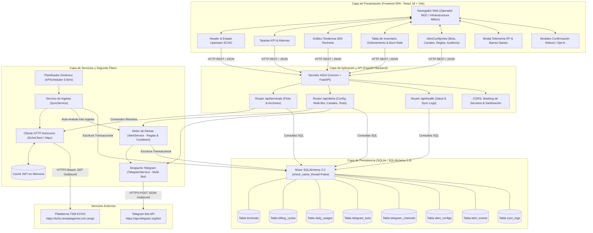
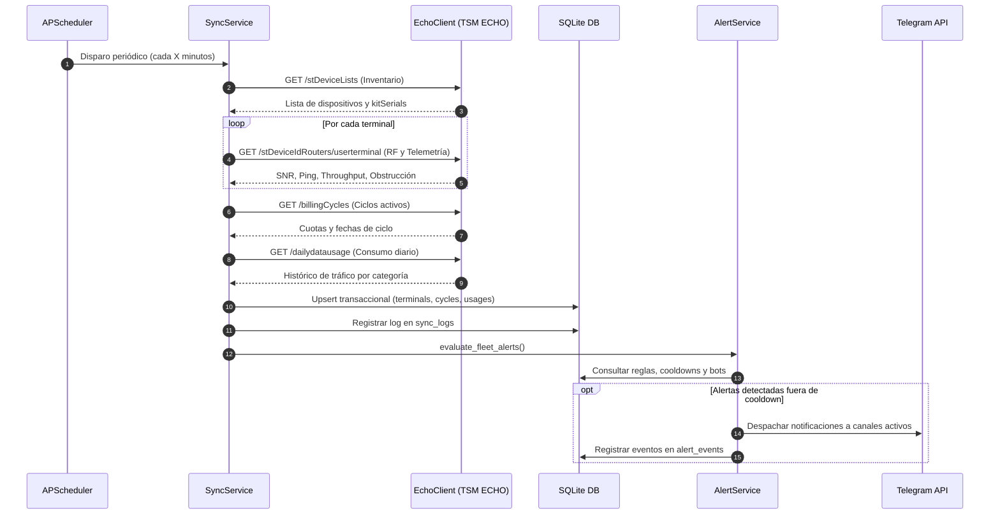
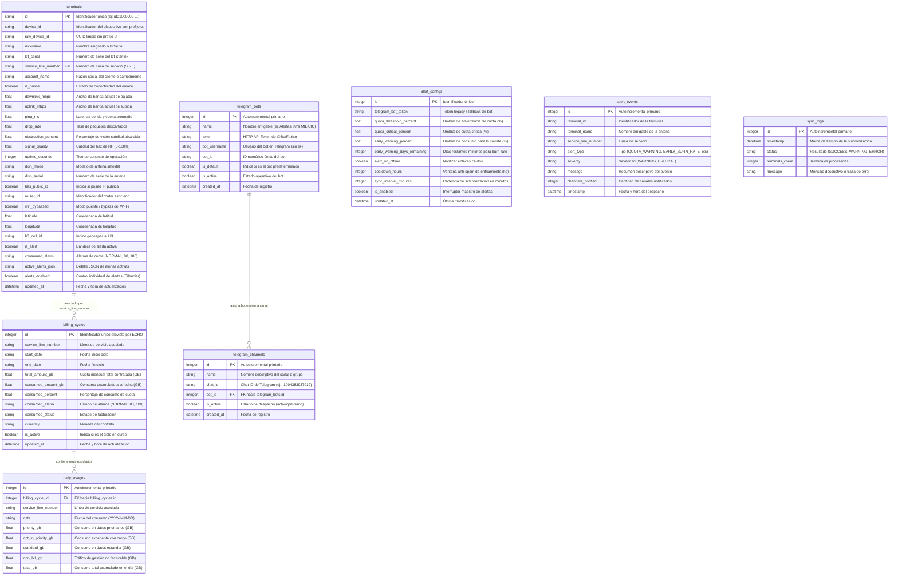

# Arquitectura de Software y Diseño Técnico

Este documento detalla la arquitectura de software, los flujos de datos, el ciclo de vida de autenticación JWT, el modelo relacional y el motor de alertas del sistema **TSM Starlink Fleet & Usage Monitor (Milicic / TSM Patagonia)**.

---

## 1. Visión General de la Arquitectura

El sistema implementa una arquitectura desacoplada y orientada a servicios, optimizada para proporcionar alta disponibilidad, baja latencia de respuesta y resiliencia ante cortes o degradaciones en la plataforma upstream de **TSM ECHO** (`https://echo.tsmpatagonia.com.ar/api`).

### Principios de Diseño:
1. **Desacoplamiento Operativo**: Los operadores y tableros de control leen exclusivamente desde una base de datos local SQLite de alta velocidad. Ninguna petición de lectura del frontend impacta de forma directa ni bloquea la API externa de ECHO.
2. **Ingesta Asíncrona Desatendida**: Un worker en segundo plano (`APScheduler`) sincroniza periódicamente el estado de la flota, telemetría de radiofrecuencia (RF), ciclos de facturación y consumo diario. La cadencia es parametrizable en caliente desde la interfaz (5 a 60 minutos).
3. **Autenticación Transparente con Auto-Recuperación**: El cliente HTTP interno gestiona el ciclo de vida del token JWT Bearer, detecta vencimientos mediante códigos `401 Unauthorized` y renueva la sesión automáticamente sin interrumpir la operación.
4. **Motor de Alertas y Despacho Multi-Bot**: Evaluación continua de doble criterio (umbrales fijos y proyección acelerada de consumo *burn-rate*) con ruteo hacia múltiples bots y canales de Telegram independientes.
5. **Comandos Críticos con Doble Factor de Confirmación**: Las operaciones remotas de impacto operativo (*Reboot* y *Data Opt-In*) se ejecutan bajo demanda hacia el backoffice de Starlink a través de endpoints seguros y modales interactivos de confirmación.

---

## 2. Diagrama de Arquitectura y Flujo de Datos



---

## 3. Ciclo de Vida del JWT y Estrategia de Autenticación

El acceso a la API interna de TSM ECHO requiere un JSON Web Token (JWT) provisto en el encabezado HTTP `Authorization: Bearer <token>`.

### 3.1. Adquisición Inicial del Token
Al instanciarse o requerir una llamada a la API sin token en memoria, [`EchoClient`](file:///c:/antigravity/tsmpatagonia/backend/app/services/echo_client.py) ejecuta la autenticación:
- **Endpoint**: `POST https://echo.tsmpatagonia.com.ar/api/login`
- **Payload**:
  ```json
  {
    "email": "it.infra@milicic.com.ar",
    "password": "****************"
  }
  ```
- **Almacenamiento**: El token resultante se guarda en memoria RAM (`self._token`). **Nunca se escribe en disco ni se persiste en base de datos**.

### 3.2. Detección de Expiración y Re-autenticación Automática
1. El cliente ejecuta la petición HTTP hacia el endpoint destino con el token actual.
2. Si la respuesta retorna un código HTTP `401 Unauthorized`:
   - El cliente invalida el token actual en memoria.
   - Dispara automáticamente una nueva llamada a `/api/login`.
   - Si la autenticación es exitosa, reintenta inmediatamente la petición original con el nuevo token.
3. Este mecanismo previene fallas intermitentes por caducidad de sesión sin intervención del operador.

---

## 4. Flujo de Ingesta Periódica (SyncService)

El proceso de sincronización se ejecuta a través de [`SyncService.sync_fleet()`](file:///c:/antigravity/tsmpatagonia/backend/app/services/sync_service.py):



---

## 5. Modelo de Datos Relacional (SQLAlchemy ORM)

### 5.1. Diagrama Entidad-Relación (ER)



---

## 6. Motor de Alertas Inteligente

### 6.1. Reglas de Evaluación
El motor evalúa concurrentemente 4 categorías de eventos:
1. **Cuota Crítica (≥ 100%)**: Dispara alerta roja ante agotamiento total de cuota contratada.
2. **Cuota de Advertencia (≥ 80%)**: Dispara alerta preventiva antes de agotar los datos prioritarios.
3. **Alerta Temprana de Ritmo Acelerado (*Burn-Rate*)**:
   $$\text{Tasa Diaria} = \frac{\text{Consumo Acumulado (GB)}}{\text{Días Transcurridos del Ciclo}}$$
   $$\text{Días para Agotamiento} = \frac{\text{Cuota Restante (GB)}}{\text{Tasa Diaria}}$$
   Si el consumo supera el umbral configurado (ej: 60%) restando más de $X$ días en el ciclo (ej: 15 días) y los días para agotar la cuota son menores a los días restantes de ciclo, se genera una advertencia preventiva de sobreconsumo.
4. **Enlace Satelital Desconectado (*Offline*)**: Si la opción está habilitada en la configuración, notifica antenas sin reporte de RF.

### 6.2. Ventana de Cooldown Anti-Spam
Para evitar saturar los canales de guardia con mensajes repetitivos cada 15 minutos:
- Cada terminal registra en memoria la última fecha de notificación por tipo de alerta.
- No se vuelve a emitir la misma alerta a los canales generales hasta transcurrido el lapso de `cooldown_hours` (configurable entre 2 y 24 horas).

### 6.3. Despacho Multi-Bot y Pruebas con Alertas Reales
- **Ruteo Multi-Bot**: Cada canal de Telegram despacha sus mensajes a través de su bot asignado (`bot_id`). Si el bot específico no está disponible, conmuta limpiamente al bot predeterminado (`is_default`).
- **Prueba en Vivo con Alertas Reales (`test_channel_with_real_alerts`)**: Evalúa el estado de la flota al momento exacto de accionar el botón, omite la ventana de cooldown y despacha todas las alertas reales vigentes al canal seleccionado, garantizando una validación fidedigna de entrega.

---

## 7. Arquitectura de Componentes Frontend (Milicic UI)

La aplicación web está estructurada en componentes desacoplados diseñados bajo los lineamientos corporativos de Milicic S.A.:

- **[`Header.jsx`](file:///c:/antigravity/tsmpatagonia/frontend/src/components/Header.jsx)**: Identidad de marca con isotipo oficial, indicador de estado de conexión upstream ECHO y accesos rápidos.
- **[`KpiCards.jsx`](file:///c:/antigravity/tsmpatagonia/frontend/src/components/KpiCards.jsx)**: 4 tarjetas métricas directas: disponibilidad de flota, terminales online/offline, consumo mensual global y balance de cuotas.
- **[`FleetChart.jsx`](file:///c:/antigravity/tsmpatagonia/frontend/src/components/FleetChart.jsx)**: Gráfico de área apilado con Recharts que ilustra la tendencia acumulada de 30 días con gradientes corporativos.
- **[`TerminalTable.jsx`](file:///c:/antigravity/tsmpatagonia/frontend/src/components/TerminalTable.jsx)**: Tabla reactiva de inventario con ordenamiento multimétrica, badges de estado, indicadores de burn-rate y conmutador individual de alertas por antena.
- **[`AlertConfigView.jsx`](file:///c:/antigravity/tsmpatagonia/frontend/src/components/AlertConfigView.jsx)**: Centro de configuración integral dividido en pestañas:
  1. *Telegram & Bots*: Alta de múltiples bots con validación `getMe`, gestión de canales y botones de prueba (`Probar Canal` y `Alertas Reales`).
  2. *Reglas de Alerta*: Parametrización de umbrales, detección de burn-rate, cooldown y cadencia del sincronizador.
  3. *Historial de Auditoría*: Bitácora de incidentes y notificaciones emitidas.
- **[`TerminalDetailModal.jsx`](file:///c:/antigravity/tsmpatagonia/frontend/src/components/TerminalDetailModal.jsx)**: Modal de telemetría de RF en tiempo real (SNR, Azimuth, Elevación, Ping, Obstrucción) y desglose de consumo por día.
- **[`ActionConfirmModal.jsx`](file:///c:/antigravity/tsmpatagonia/frontend/src/components/ActionConfirmModal.jsx)**: Modal de confirmación con doble validación de seguridad para operaciones de alto impacto (*Reboot* y *Data Opt-In*).
- **[`Toast.jsx`](file:///c:/antigravity/tsmpatagonia/frontend/src/components/Toast.jsx)**: Sistema reactivo de avisos flotantes corporativos para confirmaciones y alertas de error.
