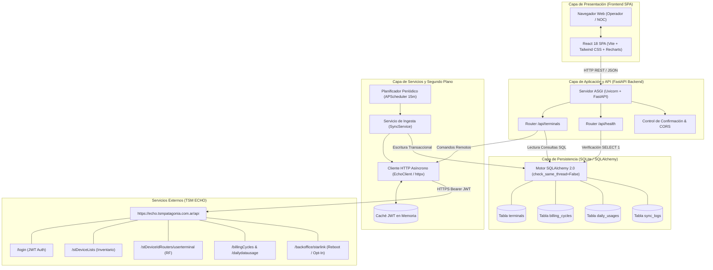
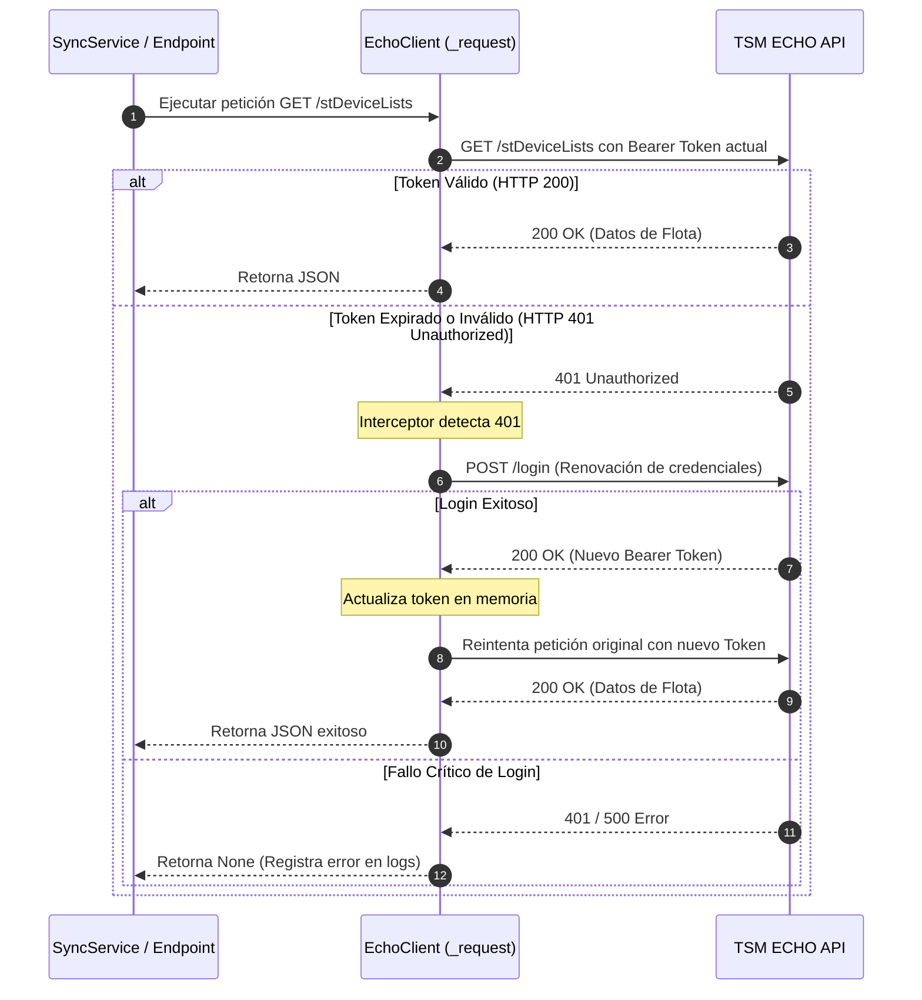
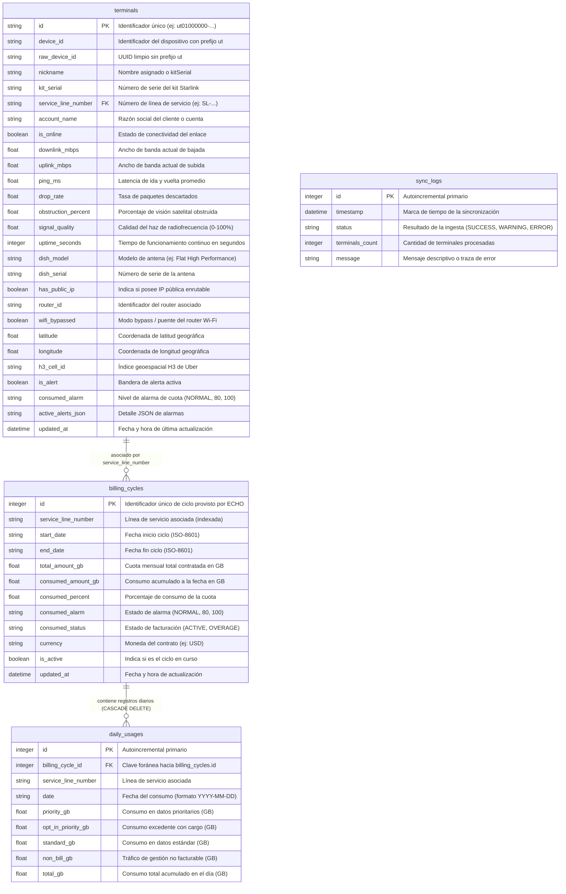

# Arquitectura de Software y Diseño Técnico

Este documento detalla la arquitectura de software, los flujos de datos, el ciclo de vida de autenticación JWT y el modelo relacional del sistema **TSM Starlink Fleet & Usage Monitor**.

---

## 1. Visión General de la Arquitectura

El sistema implementa una arquitectura desacoplada y orientada a servicios, optimizada para proporcionar alta disponibilidad, baja latencia de respuesta y resiliencia ante cortes o degradaciones en la plataforma upstream de **TSM ECHO** (`https://echo.tsmpatagonia.com.ar/api`).

### Principios de Diseño:
1. **Desacoplamiento Operativo**: Los operadores y tableros de control leen exclusivamente desde una base de datos local SQLite de alta velocidad. Ninguna petición de lectura del frontend impacta de forma directa ni bloquea la API externa de ECHO.
2. **Ingesta Asíncrona Desatendida**: Un worker en segundo plano (`APScheduler`) se encarga periódicamente de sincronizar el estado de la flota, telemetría de radiofrecuencia (RF), ciclos de facturación y consumo diario.
3. **Autenticación Transparente con Auto-Recuperación**: El cliente HTTP interno gestiona el ciclo de vida del token JWT Bearer, detecta vencimientos mediante códigos `401 Unauthorized` y renueva la sesión automáticamente sin interrumpir la operación.
4. **Comandos Críticos con Doble Factor de Confirmación**: Las operaciones remotas de impacto operativo (*Reboot* y *Data Opt-In*) se ejecutan bajo demanda hacia el backoffice de Starlink a través de endpoints seguros y modales interactivos de confirmación.

---

## 2. Diagrama de Arquitectura y Flujo de Datos



---

## 3. Ciclo de Vida del JWT y Estrategia de Autenticación

El acceso a la API interna de TSM ECHO requiere un token JSON Web Token (JWT) provisto en el encabezado HTTP `Authorization: Bearer <token>`.

### 3.1. Adquisición Inicial del Token
Al instanciarse o requerir una llamada a la API sin token en memoria, [`EchoClient`](file:///c:/antigravity/tsmpatagonia/backend/app/services/echo_client.py) ejecuta la autenticación:
- **Endpoint**: `POST https://echo.tsmpatagonia.com.ar/api/login`
- **Payload**:
  ```json
  {
    "email": "it.infra@milicic.com.ar",
    "password": "****************"
  }
  ```
- **Respuesta**:
  ```json
  {
    "token": "eyJhbGciOiJIUzI1NiIsInR5cCI6IkpXVCJ9...",
    "id": 44,
    "perfil_id": 4,
    "grupo_id": 3
  }
  ```
El token, el `user_id`, el `perfil_id` y el `grupo_id` se almacenan en el estado interno del cliente en memoria.

### 3.2. Manejo Automático de Errores 401 y Re-Login Transparente
Dado que los tokens JWT de ECHO tienen una ventana de expiración definida, el método interno `_request()` intercepta las respuestas HTTP:



### 3.3. Modo Contingencia / Demo
Si las variables de entorno `ECHO_EMAIL` y `ECHO_PASSWORD` no están definidas o la red externa es inalcanzable:
- `EchoClient.has_credentials` evalúa a `False`.
- El sistema no detiene su arranque ni genera excepciones no controladas.
- En la primera ejecución, [`SyncService`](file:///c:/antigravity/tsmpatagonia/backend/app/services/sync_service.py) inicializa una flota de demostración con 8 terminales georreferenciadas y 20 días de consumo simulado.
- Si ya existían datos en la base local, se preserva el último snapshot disponible y el endpoint `/api/health` reporta estado `degraded` con advertencia explicativa.
- Tan pronto se configuran credenciales válidas, el sistema detecta terminales reales en `/stDeviceLists`, purga los datos simulados y consolida la flota en vivo.

---

## 4. Estrategia de Ingesta del Worker (`APScheduler`)

Para evitar la saturación de los servidores de TSM ECHO y proveer tiempos de respuesta inferiores a 10 ms en el frontend, se implementa una tarea desatendida planificada.

### 4.1. Configuración del Scheduler
- **Librería**: `apscheduler.schedulers.asyncio.AsyncIOScheduler`
- **Disparador**: `IntervalTrigger(minutes=settings.SYNC_INTERVAL_MINUTES)` (por defecto cada 15 minutos).
- **Ciclo de Vida (Lifespan)**:
  1. Al iniciar la aplicación FastAPI (`backend/app/main.py`), se arranca el scheduler.
  2. Se programa un disparo inicial inmediato (`run_sync`) para garantizar que la base de datos esté actualizada desde el arranque.
  3. Al detener el servidor (`shutdown`), el scheduler se cierra de forma ordenada mediante `scheduler.shutdown()`.

### 4.2. Algoritmo de Sincronización Jerárquica
Cada ciclo de ingesta ejecuta el siguiente orden de operaciones:

1. **Consulta de Inventario Global**:
   - Invoca `GET /stDeviceLists`. Si el perfil del usuario no posee acceso global (Perfil 4), utiliza el fallback `GET /stDeviceLists/user/{user_id}`.
   - Extrae la lista de `deviceId`, `kitSerial`, `nickname`, `serviceLineNumber`, `isOnline` y `downlink`.
2. **Saneamiento de Base de Datos**:
   - Si se reciben identificadores reales, se eliminan los registros huérfanos o de demostración que no coincidan con la flota reportada.
3. **Telemetría RF por Terminal**:
   - Para cada enlace, invoca `GET /stDeviceIdRouters/userterminal/{clean_id}` (donde `clean_id` es el UUID sin el prefijo `ut`).
   - Extrae métricas físicas: Throughput de bajada y subida en Mbps (convirtiendo desde bps), latencia de ping, calidad de señal (%), porcentaje de tiempo obstruido, uptime acumulado y celda geográfica H3.
4. **Ciclos de Facturación por Service Line**:
   - Con el `serviceLineNumber`, consulta `GET /billingCycles/{serviceLineNumber}`.
   - Identifica el ciclo activo (último elemento del arreglo), calculando cuota contratada en GB (`DBtotalAmountGB`), consumo actual (`DBconsumedAmountGB`), porcentaje de utilización y estados de alarma (`NORMAL`, `80` o `100`).
5. **Consumo Diario del Ciclo**:
   - Con el `billingCycle.id` activo, consulta `GET /dailydatausage/{billingCycleId}`.
   - Inserta o actualiza los consumos por fecha (`YYYY-MM-DD`), desagregando:
     * `priority_gb` (Datos Prioritarios)
     * `opt_in_priority_gb` (Datos Prioritarios Excedentes Opt-In)
     * `standard_gb` (Datos Estándar Ilimitados)
     * `non_bill_gb` (Tráfico no facturable)
     * `total_gb` (Suma total del día)
6. **Auditoría y Transaccionalidad**:
   - Se ejecuta `db.commit()` tras procesar exitosamente la flota.
   - Se registra una entrada en la tabla `sync_logs` con el total de terminales sincronizadas, marca de tiempo y estado (`SUCCESS` o `ERROR`).
   - En caso de excepción, se invoca `db.rollback()` para garantizar la consistencia relacional.

---

## 5. Modelo de Datos Relacional (SQLite / SQLAlchemy)

La persistencia se implementa sobre SQLite utilizando SQLAlchemy 2.0 con soporte multihilo (`check_same_thread=False`).

### 5.1. Diagrama Entidad-Relación (ER)



### 5.2. Detalle de Tablas y Restricciones

#### Tabla `terminals`
- Almacena el inventario de antenas, su estado operacional y métricas de RF.
- **Índices**: `id` (PK), `device_id`, `service_line_number`.
- Permite búsquedas textuales optimizadas (`ilike`) por `nickname`, `kit_serial`, `service_line_number` y `account_name`.

#### Tabla `billing_cycles`
- Representa los períodos de facturación de cada línea de servicio.
- **Índices**: `id` (PK asignada por ECHO), `service_line_number`.
- Relación uno a muchos con `daily_usages` con eliminación en cascada (`ondelete="CASCADE"`).

#### Tabla `daily_usages`
- Desglose diario de datos transmitidos por tipo de servicio.
- **Índices**: `id` (PK), `billing_cycle_id` (FK), `service_line_number`, `date`.
- **Restricción de Unicidad Compuesta**: `Index("ix_cycle_date", "billing_cycle_id", "date", unique=True)` que previene duplicación de métricas al re-sincronizar el mismo día.

#### Tabla `sync_logs`
- Bitácora de auditoría para supervisar la salud del worker en segundo plano y diagnosticar problemas de conectividad upstream.
- Permite al frontend determinar con precisión cuándo fue el último refresco exitoso.

---

## 6. Sistema de Diseño Milicic UI & Arquitectura de Componentes

La capa de frontend implementa el sistema de diseño corporativo **Milicic UI** ([`.agent/skills/diseno-UI-milicic/SKILL.md`](file:///c:/antigravity/tsmpatagonia/.agent/skills/diseno-UI-milicic/SKILL.md)):

### 6.1. Tokens y Variables Visuales
- **Canvas Base (`#0F141A`)**: Fondo oscuro profundo con tinte pizarra.
- **Superficie de Tarjetas (`#1A222B`)**: Contenedores elevados con bordes de contraste `#2A3441`.
- **Naranja Milicic (`#F39200`)**: Color primario para botones de acción, acentos de selección y líneas de tendencia destacadas.
- **Estados Operativos**:
  - `Activo / Online`: Verde esmeralda `#10B981` con pulso lumínico.
  - `Offline / Crítico`: Rojo rubí `#EF4444`.
  - `Advertencia / Cuota > 80%`: Ámbar `#F59E0B`.

### 6.2. Componentes Desacoplados
- **[`MilicicLogo.jsx`](file:///c:/antigravity/tsmpatagonia/frontend/src/components/MilicicLogo.jsx)**: Componente corporativo optimizado para renderizar el isotipo de franjas y texto institucional sin artefactos ni degradación por escalado.
- **[`Header.jsx`](file:///c:/antigravity/tsmpatagonia/frontend/src/components/Header.jsx)**: Header corporativo con badge de estado del upstream ECHO y botón de sincronización manual interactivo con spinner.
- **[`KpiCards.jsx`](file:///c:/antigravity/tsmpatagonia/frontend/src/components/KpiCards.jsx)**: 4 métricas directas: Disponibilidad de flota, Terminales online/offline, Consumo global en GB y Estado de cuotas prioritarias.
- **[`FleetChart.jsx`](file:///c:/antigravity/tsmpatagonia/frontend/src/components/FleetChart.jsx)**: Gráfico Recharts con gradientes de color corporativos Milicic, tooltips personalizados y formato de fechas dinámico.
- **[`TerminalTable.jsx`](file:///c:/antigravity/tsmpatagonia/frontend/src/components/TerminalTable.jsx)**: Tabla de inventario de alto rendimiento con barra de búsqueda reactiva y filtros por estado.
- **[`TerminalDetailModal.jsx`](file:///c:/antigravity/tsmpatagonia/frontend/src/components/TerminalDetailModal.jsx)**: Ficha técnica emergente con métricas de RF en vivo (SNR, Azimuth, Elevación, Ping) e histograma de consumo diario.
- **[`ActionConfirmModal.jsx`](file:///c:/antigravity/tsmpatagonia/frontend/src/components/ActionConfirmModal.jsx)**: Modal de doble confirmación para salvaguardar acciones críticas (*Reboot* y *Data Opt-In*).
- **[`Toast.jsx`](file:///c:/antigravity/tsmpatagonia/frontend/src/components/Toast.jsx)**: Notificaciones flotantes no invasivas para confirmación de comandos y avisos de red.

---

## 7. Arquitectura de Red y Enrutamiento Dokploy + Traefik

El sistema en producción opera en un entorno contenerizado administrado por Dokploy:

1. **Ingress Traefik Dinámico**: Traefik escucha peticiones en los puertos 80 y 443 del host. Mediante su proveedor de Docker conectado a `/var/run/docker.sock`, detecta automáticamente el contenedor `tsm_starlink_frontend` a través de sus etiquetas:
   - `traefik.enable=true`
   - `traefik.http.routers.starlink-frontend.rule=Host('starlink.milicic.local')`
   - `traefik.docker.network=dokploy-network`
2. **Red Interna `dokploy-network`**: Permite la comunicación segura y directa entre Traefik y el frontend sin exponer puertos al sistema operativo anfitrión.
3. **Servidor Web Nginx Interno**: El contenedor de frontend ejecuta Nginx en el puerto 80, sirviendo los activos estáticos compilados de React e implementando un proxy inverso para la ruta `/api/` hacia `http://backend:8000/api/`.
4. **Persistencia Transaccional**: El backend monta el volumen nombrado de Docker `starlink_data` en `/app/data`, asegurando que la base de datos `starlink_dashboard.db` conserve los históricos aun cuando los contenedores se reconstruyan o actualicen.

