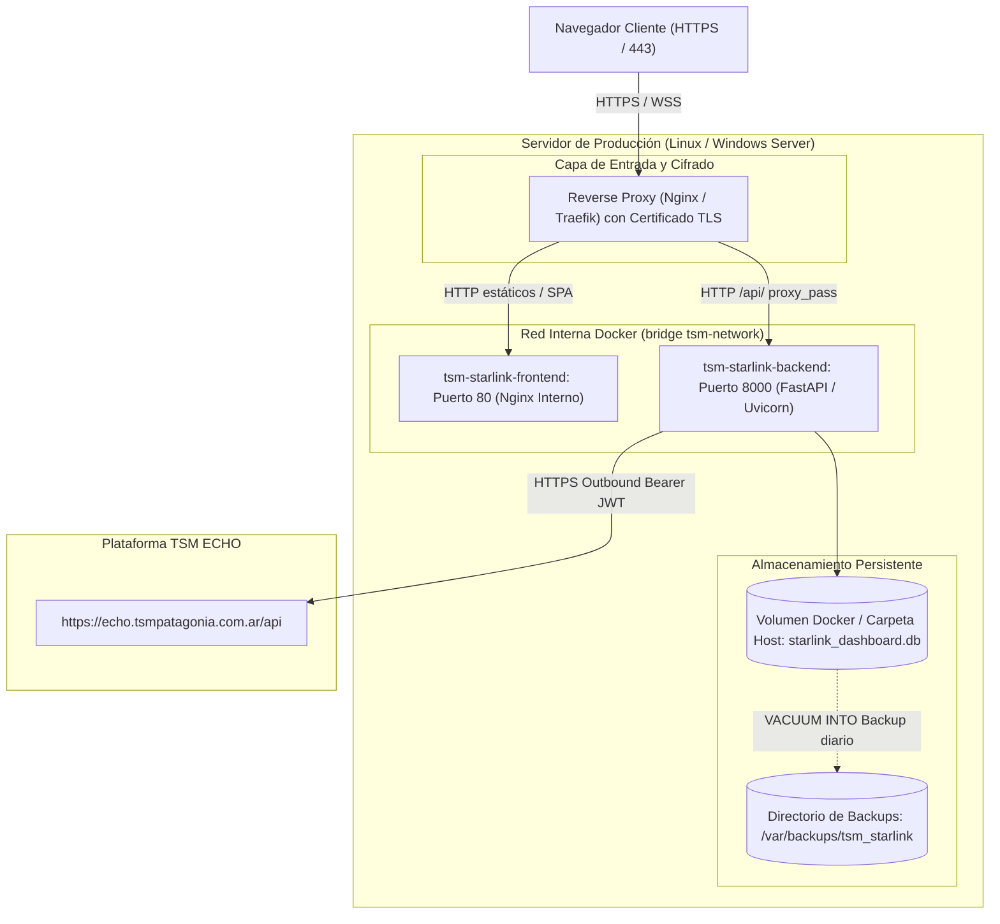

# Guía de Despliegue en Producción, Seguridad y Operaciones

Esta guía describe los procedimientos operativos estándar (SOP) para poner en producción, asegurar, monitorear y respaldar la plataforma **TSM Starlink Fleet & Usage Monitor**.

---

## 📋 Tabla de Contenidos

- [1. Arquitectura de Despliegue en Producción](#1-arquitectura-de-despliegue-en-producción)
- [2. Despliegue con Docker y Docker Compose](#2-despliegue-con-docker-y-docker-compose)
  - [2.1. Variables de Entorno Productivas](#21-variables-de-entorno-productivas)
  - [2.2. Configuración de docker-compose.prod.yml](#22-configuración-de-docker-composeprodyml)
  - [2.3. Comandos de Operación](#23-comandos-de-operación)
- [3. Configuración de Reverse Proxy y Terminación TLS/SSL](#3-configuración-de-reverse-proxy-y-terminación-tlsssl)
  - [Opción A: Servidor Nginx con Let's Encrypt (Certbot)](#opción-a-servidor-nginx-con-lets-encrypt-certbot)
  - [Opción B: Traefik v3 con Generación Automática de Certificados](#opción-b-traefik-v3-con-generación-automática-de-certificados)
- [4. Estrategia de Backup y Recuperación de SQLite](#4-estrategia-de-backup-y-recuperación-de-sqlite)
  - [4.1. Respaldo en Caliente con VACUUM INTO](#41-respaldo-en-caliente-con-vacuum-into)
  - [4.2. Script Automatizado para Linux (Cron)](#42-script-automatizado-para-linux-cron)
  - [4.3. Script Automatizado para Windows (PowerShell)](#43-script-automatizado-para-windows-powershell)
  - [4.4. Procedimiento de Restauración (Disaster Recovery)](#44-procedimiento-de-restauración-disaster-recovery)
- [5. Rotación Segura de Credenciales y Secretos](#5-rotación-segura-de-credenciales-y-secretos)
- [6. Supervisión y Healthchecks](#6-supervisión-y-healthchecks)

---

## 1. Arquitectura de Despliegue en Producción

En entornos de producción, la solución se distribuye en una topología aislada protegida por un Reverse Proxy con terminación SSL/TLS:



---

## 2. Despliegue con Docker y Docker Compose

### 2.1. Variables de Entorno Productivas

Crea un archivo `.env` en el servidor con permisos restrictivos (`chmod 600 .env` en Linux):

```env
# URL Upstream
ECHO_BASE_URL=https://echo.tsmpatagonia.com.ar/api

# Credenciales de Servicio Dedicadas
ECHO_EMAIL=it.infra@milicic.com.ar
ECHO_PASSWORD=ClaveDeProduccionSuperSegura2026!

# Intervalo del Worker en Minutos
SYNC_INTERVAL_MINUTES=15

# Ruta interna en el contenedor
DATABASE_URL=sqlite:////data/starlink_dashboard.db

# Configuración FastAPI
HOST=0.0.0.0
PORT=8000
ENVIRONMENT=production
```

### 2.2. Configuración de `docker-compose.prod.yml`

Para un entorno productivo con límites de recursos, reinicio automático y volúmenes persistentes, utiliza el siguiente archivo de orquestación:

```yaml
version: '3.8'

services:
  backend:
    build:
      context: ./backend
      dockerfile: Dockerfile
    image: tsm-starlink-backend:latest
    container_name: tsm-starlink-backend
    restart: always
    env_file:
      - .env
    volumes:
      # Persistencia de base de datos fuera del ciclo de vida del contenedor
      - ./data:/data
    networks:
      - tsm-network
    deploy:
      resources:
        limits:
          cpus: '1.50'
          memory: 1024M
        reservations:
          cpus: '0.25'
          memory: 256M
    healthcheck:
      test: ["CMD-SHELL", "curl -f http://localhost:8000/api/health || exit 1"]
      interval: 30s
      timeout: 10s
      retries: 3
      start_period: 15s

  frontend:
    build:
      context: ./frontend
      dockerfile: Dockerfile
    image: tsm-starlink-frontend:latest
    container_name: tsm-starlink-frontend
    restart: always
    ports:
      - "3000:80"
    depends_on:
      backend:
        condition: service_healthy
    networks:
      - tsm-network
    deploy:
      resources:
        limits:
          cpus: '0.50'
          memory: 256M

networks:
  tsm-network:
    driver: bridge
```

### 2.3. Comandos de Operación

```bash
# 1. Crear directorio para datos persistentes
mkdir -p data

# 2. Construir imágenes e iniciar contenedores
docker compose -f docker-compose.prod.yml up -d --build

# 3. Comprobar salud y estado de los contenedores
docker compose -f docker-compose.prod.yml ps

# 4. Inspeccionar registros en vivo del backend
docker compose -f docker-compose.prod.yml logs -f backend

# 5. Detener la aplicación de forma ordenada
docker compose -f docker-compose.prod.yml down
```

---

## 3. Configuración de Reverse Proxy y Terminación TLS/SSL

### Opción A: Servidor Nginx con Let's Encrypt (Certbot)

Configuración recomendada para `/etc/nginx/sites-available/starlink.tsmpatagonia.com.ar`:

```nginx
# Redirección HTTP a HTTPS
server {
    listen 80;
    listen [::]:80;
    server_name starlink.tsmpatagonia.com.ar;
    return 301 https://$host$request_uri;
}

# Servidor HTTPS Productivo
server {
    listen 443 ssl http2;
    listen [::]:443 ssl http2;
    server_name starlink.tsmpatagonia.com.ar;

    # Certificados TLS administrados por Certbot
    ssl_certificate /etc/letsencrypt/live/starlink.tsmpatagonia.com.ar/fullchain.pem;
    ssl_certificate_key /etc/letsencrypt/live/starlink.tsmpatagonia.com.ar/privkey.pem;
    include /etc/letsencrypt/options-ssl-nginx.conf;
    ssl_dhparam /etc/letsencrypt/ssl-dhparams.pem;

    # Encabezados de Seguridad
    add_header Strict-Transport-Security "max-age=31536000; includeSubDomains" always;
    add_header X-Frame-Options "SAMEORIGIN" always;
    add_header X-Content-Type-Options "nosniff" always;
    add_header Referrer-Policy "strict-origin-when-cross-origin" always;
    add_header Content-Security-Policy "default-src 'self'; script-src 'self' 'unsafe-inline'; style-src 'self' 'unsafe-inline' https://fonts.googleapis.com; font-src 'self' https://fonts.gstatic.com; connect-src 'self' http://localhost:8000;" always;

    # Compresión Gzip
    gzip on;
    gzip_types text/plain text/css application/json application/javascript text/xml application/xml application/xml+rss text/javascript;

    # Enrutamiento hacia el Frontend SPA (Contenedor Nginx en puerto 3000)
    location / {
        proxy_pass http://127.0.0.1:3000;
        proxy_set_header Host $host;
        proxy_set_header X-Real-IP $remote_addr;
        proxy_set_header X-Forwarded-For $proxy_add_x_forwarded_for;
        proxy_set_header X-Forwarded-Proto $scheme;
    }

    # Enrutamiento directo al Backend API (FastAPI en puerto 8000)
    location /api/ {
        proxy_pass http://127.0.0.1:8000/api/;
        proxy_http_version 1.1;
        proxy_set_header Upgrade $http_upgrade;
        proxy_set_header Connection "upgrade";
        proxy_set_header Host $host;
        proxy_set_header X-Real-IP $remote_addr;
        proxy_set_header X-Forwarded-For $proxy_add_x_forwarded_for;
        proxy_set_header X-Forwarded-Proto $scheme;
        proxy_read_timeout 60s;
        proxy_connect_timeout 60s;
    }
}
```

### Opción B: Traefik v3 con Generación Automática de Certificados

Si utilizas Traefik en tu cluster Docker, añade las siguientes etiquetas en el servicio `frontend`:

```yaml
labels:
  - "traefik.enable=true"
  - "traefik.http.routers.starlink.rule=Host(`starlink.tsmpatagonia.com.ar`)"
  - "traefik.http.routers.starlink.entrypoints=websecure"
  - "traefik.http.routers.starlink.tls.certresolver=letsencrypt"
  - "traefik.http.services.starlink.loadbalancer.server.port=80"
```

---

## 4. Estrategia de Backup y Recuperación de SQLite

> [!CAUTION]
> **Nunca utilices un simple comando de copia (`cp` o `copy`)** sobre un archivo SQLite en un sistema de producción mientras la aplicación está escribiendo. Esto puede generar una copia corrupta o inconsistente si coincide con una transacción en curso o con el diario Write-Ahead Logging (WAL).

### 4.1. Respaldo en Caliente con `VACUUM INTO`
SQLite incorpora la instrucción atómica `VACUUM INTO 'ruta_destino.db'`, la cual crea una copia de seguridad compactada, consistente y libre de locks sin necesidad de detener el servicio FastAPI.

### 4.2. Script Automatizado para Linux (Cron)

Crea el archivo `/opt/tsm_starlink/scripts/backup_sqlite.sh`:

```bash
#!/bin/bash
set -euo pipefail

BACKUP_DIR="/var/backups/tsm_starlink"
DATE_STR=$(date +%Y%m%d_%H%M%S)
BACKUP_FILE="${BACKUP_DIR}/starlink_db_${DATE_STR}.db"
CONTAINER_NAME="tsm-starlink-backend"

mkdir -p "${BACKUP_DIR}"

echo "[$(date)] Iniciando backup en caliente de SQLite..."

# Ejecución de VACUUM INTO dentro del contenedor
docker exec "${CONTAINER_NAME}" python -c "
import sqlite3
con = sqlite3.connect('/data/starlink_dashboard.db')
con.execute(\"VACUUM INTO '/data/backup_temp.db'\")
con.close()
"

# Mover el archivo al almacenamiento de host y comprimir
mv ./data/backup_temp.db "${BACKUP_FILE}"
gzip -9 "${BACKUP_FILE}"

echo "[$(date)] Backup completado exitosamente: ${BACKUP_FILE}.gz"

# Política de retención: conservar backups de los últimos 14 días
find "${BACKUP_DIR}" -name "starlink_db_*.db.gz" -type f -mtime +14 -delete
echo "[$(date)] Tareas de limpieza de backups antiguos concluidas."
```

Configuración en Crontab (`crontab -e`):
```cron
# Ejecutar backup diario a las 02:00 AM
0 2 * * * /opt/tsm_starlink/scripts/backup_sqlite.sh >> /var/log/tsm_backup.log 2>&1
```

### 4.3. Script Automatizado para Windows (PowerShell)

Para entornos Windows Server, crea `backup_sqlite.ps1`:

```powershell
$BackupDir = "C:\Backups\TSM_Starlink"
$DateStr = Get-Date -Format "yyyyMMdd_HHmmss"
$BackupPath = "$BackupDir\starlink_db_$DateStr.db"
$DbPath = "c:\antigravity\tsmpatagonia\starlink_dashboard.db"

if (-not (Test-Path $BackupDir)) {
    New-Item -ItemType Directory -Path $BackupDir | Out-Null
}

Write-Host "Ejecutando backup en caliente con VACUUM INTO..."
$Sql = "VACUUM INTO '$BackupPath';"
& sqlite3.exe $DbPath $Sql

if (Test-Path $BackupPath) {
    Write-Host "Backup generado correctamente en $BackupPath"
    # Eliminar copias con más de 14 días
    Get-ChildItem -Path $BackupDir -Filter "*.db" | Where-Object { $_.LastWriteTime -lt (Get-Date).AddDays(-14) } | Remove-Item
} else {
    Write-Error "Fallo al generar el backup de SQLite."
}
```

### 4.4. Procedimiento de Restauración (Disaster Recovery)

En caso de requerir restauración por corrupción de datos o migración de servidor:

1. **Detener el backend**:
   ```bash
   docker compose -f docker-compose.prod.yml stop backend
   ```
2. **Reemplazar el archivo de base de datos**:
   ```bash
   # Si el backup está comprimido:
   gunzip -c /var/backups/tsm_starlink/starlink_db_20260921_020000.db.gz > ./data/starlink_dashboard.db
   ```
3. **Verificar la integridad del archivo restaurado**:
   ```bash
   sqlite3 ./data/starlink_dashboard.db "PRAGMA integrity_check;"
   # Debe retornar: ok
   ```
4. **Reiniciar el backend**:
   ```bash
   docker compose -f docker-compose.prod.yml start backend
   ```
5. **Verificar el endpoint de salud**:
   ```bash
   curl http://localhost:8000/api/health
   ```

---

## 5. Rotación Segura de Credenciales y Secretos

Cuando se actualice la contraseña de la cuenta de TSM ECHO (`ECHO_PASSWORD`):

1. **Actualizar el archivo `.env`**:
   Edita `.env` en el servidor con el nuevo valor de `ECHO_PASSWORD`.
2. **Aplicar los cambios sin caída de servicio**:
   ```bash
   # Recrea únicamente el contenedor backend aplicando las nuevas variables:
   docker compose -f docker-compose.prod.yml up -d --no-deps backend
   ```
3. **Comprobar la re-autenticación**:
   Inspecciona los logs del backend para confirmar el nuevo login exitoso:
   ```bash
   docker compose logs backend | grep "Successfully authenticated to TSM ECHO"
   ```
4. **Disparar una sincronización de verificación**:
   ```bash
   curl -X POST http://localhost:8000/api/terminals/sync
   ```

---

## 6. Supervisión y Healthchecks

Para integrar el dashboard con herramientas de monitoreo externas (Zabbix, Prometheus, Datadog, Uptime Kuma):

- **URL de Verificación**: `https://starlink.tsmpatagonia.com.ar/api/health`
- **Condición de Alerta**:
  * Código HTTP distinto de `200`.
  * Clave JSON `"status"` diferente de `"online"`.
  * Clave JSON `"database_connected"` igual a `false`.
  * Clave JSON `"last_sync.status"` igual a `"ERROR"`.
- **Métricas Clave a Vigilar**:
  * Uso de CPU y memoria del contenedor `tsm-starlink-backend`.
  * Tamaño en disco de `starlink_dashboard.db` (crecimiento esperado: ~5 MB / año).
  * Latencia de respuesta de los endpoints (`< 50 ms`).
