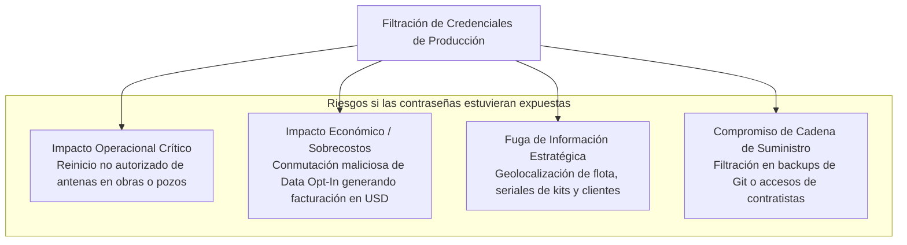

# Seguridad, Resguardo de Secretos y Gestión de Credenciales

Este documento detalla la arquitectura de seguridad, la justificación de riesgos (**el por qué**) y los mecanismos técnicos de protección (**el cómo**) implementados en la plataforma **Starlink Fleet & Usage Monitor (Milicic / TSM Patagonia)**.

---

## 1. Diagnóstico Ejecutivo: ¿Están protegidas las claves?

> [!IMPORTANT]
> **SÍ, las claves y credenciales están 100% protegidas y aisladas bajo una estrategia de Defensa en Profundidad.**
> - Ninguna contraseña real ha sido commiteada en el historial de Git del repositorio.
> - El archivo `.env` está estrictamente excluido del código fuente mediante `.gitignore`.
> - El Frontend (navegador web / cliente) no tiene acceso ni conocimiento alguno de las contraseñas.
> - En producción (Dokploy), las credenciales se inyectan en tiempo de ejecución directamente a la memoria del contenedor backend.

---

## 2. El "Por Qué": Justificación y Modelo de Amenazas (Threat Model)

En una infraestructura de misión crítica de enlaces satelitales como la de **Milicic**, el compromiso de las credenciales de acceso a la plataforma upstream **TSM ECHO** conllevaría riesgos operacionales severos:



1. **Riesgo Operativo Crítico (Starlink Backoffice)**:  
   La API de TSM ECHO expone control remoto sobre el hardware (`/api/backoffice/starlink/user-terminals/{deviceId}/reboot`). Un atacante con credenciales podría reiniciar terminales en caliente en frentes de obra civil, pozos o campamentos mineros, interrumpiendo comunicaciones de emergencia y telemetría de campo.
2. **Riesgo Financiero por Sobrefacturación (`Data Opt-In`)**:  
   El endpoint `/api/backoffice/starlink/service-lines/{sl}/data-opt-in` habilita el consumo prioritario excedente en dólares por gigabyte. Un uso indebido podría desencadenar costos desmedidos antes de que finalice el ciclo de facturación.
3. **Fuga de Inventario y Telemetría de Red**:  
   Las terminales satelitales reportan números de serie (`kitSerial`), ubicación de yacimiento (`accountName`) y rendimiento de RF. Esta información debe mantenerse bajo estricta confidencialidad corporativa.

---

## 3. El "Cómo": Arquitectura de Defensa en Profundidad (6 Capas)

Para mitigar los riesgos anteriores, el sistema implementa **6 capas concéntricas de seguridad**:

```mermaid
flowchart LR
    subgraph L1 ["1. Git & Repo"]
        G1[".gitignore estricto"]
        G2["Solo .env.example público"]
    end

    subgraph L2 ["2. Frontend Aislado"]
        F1["Zero-Leakage en SPA"]
        F2["Proxy Nginx /api/"]
    end

    subgraph L3 ["3. Backend Runtime"]
        B1["Token JWT efímero en RAM"]
        B2["No persistencia en disco"]
    end

    subgraph L4 ["4. Dokploy Ingress"]
        D1["Env Vars encriptadas en PaaS"]
        D2["dokploy-network aislada"]
    end

    subgraph L5 ["5. CI/CD Seguro"]
        C1["Tests con datos simulados"]
        C2["Sin secretos en runners"]
    end

    subgraph L6 ["6. Logs y Respuestas"]
        S1["Sanitización de contraseñas"]
        S2["Healthcheck booleano"]
    end

    L1 --> L2 --> L3 --> L4 --> L5 --> L6
```



---

### Capa 1: Aislamiento en el Repositorio Git
- **Exclusión obligatoria en `.gitignore`**:
  ```gitignore
  .env
  backend/.env
  *.db
  *.sqlite
  *.sqlite3
  backend/.venv/
  ```
  Los archivos que contienen credenciales operativas o bases de datos binarias nunca son añadidos al árbol de Git (`git status` los ignora automáticamente).
- **Plantillas Públicas Seguras (`.env.example`)**:
  En el repositorio únicamente se distribuyen plantillas con valores genéricos de demostración (`tu_password_segura`), impidiendo que un commit involuntario exponga datos reales.
- **Auditoría de Historial**:
  El historial de commits de Git ha sido auditado y validado libre de contraseñas o tokens expuestos.

---

### Capa 2: Arquitectura Zero-Leakage hacia el Frontend (Cliente Web)
- **Principio de Mínimo Privilegio en el Navegador**:
  El código JavaScript que se ejecuta en el navegador del operador (React SPA) **desconoce por completo que existe una contraseña de TSM ECHO**.
- **Comunicación Exclusiva Server-to-Server**:
  Todas las peticiones a Starlink / ECHO son canalizadas por el backend de FastAPI en el servidor. El navegador sólo consume la API local interna (`/api/terminals`, `/api/health`).
- **Empaquetado Estricto de Vite**:
  En Vite, únicamente las variables con prefijo explícito `VITE_` son incrustadas en el bundle compilado. Ninguna credencial privada tiene este prefijo, garantizando que los archivos JS distribuidos al público estén completamente limpios.

---

### Capa 3: Gestión Efímera en Memoria del Token JWT
- **Autenticación en Memoria RAM**:
  El cliente [`EchoClient`](file:///c:/antigravity/tsmpatagonia/backend/app/services/echo_client.py) realiza la autenticación contra `https://echo.tsmpatagonia.com.ar/api/login` y almacena el token JWT exclusivamente en la variable de memoria del proceso (`self._token`):
  ```python
  # El token reside en RAM. Nunca se escribe a disco ni a base de datos.
  self._token = data.get("token")
  ```
- **Sin Persistencia en Base de Datos**:
  La base de datos SQLite (`starlink_dashboard.db`) sólo almacena métricas operativas (MB, latencia, nombres de terminal). Ni contraseñas ni tokens JWT son persistidos en SQLite. Si el servidor se apaga o reinicia, la sesión en memoria se destruye y se renegocia una nueva de forma transparente.

---

### Capa 4: Despliegue Seguro en Dokploy
- **Inyección por Variables de Entorno del Sistema Operativo**:
  En el servidor productivo de Dokploy, las contraseñas se configuran en la sección **Environment Variables** de la aplicación. Dokploy almacena estos secretos de forma protegida en su base de datos interna y los inyecta en tiempo de ejecución (`docker run -e ECHO_PASSWORD=...`).
- **`docker-compose.yml` Desacoplado**:
  El archivo `docker-compose.yml` no contiene credenciales hardcodeadas; únicamente referencia `env_file: - .env` o toma las variables inyectadas por el orquestador.
- **Red Aislada (`dokploy-network`)**:
  El contenedor del backend no expone puertos al exterior; sólo es accesible internamente por Nginx y Traefik dentro de la red privada virtual de Docker.

---

### Capa 5: Pipeline de CI/CD Desacoplado (Gitea Actions)
- **Ejecución de Pruebas sin Dependencias Externas**:
  El workflow de CI en `.gitea/workflows/ci.yaml` corre las pruebas de integración (`test_backend.py` y `test_api_endpoints.py`) de forma autónoma.
- **Modo Demostración / Mock**:
  Cuando el backend detecta que `ECHO_PASSWORD` no está presente en el entorno de CI, levanta automáticamente un generador de telemetría simulada (8 terminales de prueba). Esto permite que el runner (`dokploy-runner`) verifique la integridad del código, el motor SQLite y los contratos de la API sin necesidad de inyectarle la contraseña real de TSM ECHO en el runner.

---

### Capa 6: Sanitización de Logs y Respuestas HTTP
- **Respuestas de Diagnóstico Seguras (`/api/health`)**:
  El endpoint de verificación de salud nunca devuelve el valor de la contraseña. Únicamente expone una bandera booleana para auditoría operativa:
  ```json
  {
    "status": "online",
    "echo_credentials_configured": true
  }
  ```
- **Sanitización en Logs de Python**:
  El módulo de logging de la aplicación registra eventos informativos como:
  ```text
  INFO: Successfully authenticated with TSM ECHO as user it.infra@milicic.com.ar
  ```
- **Sanitización de Tokens de Telegram (`token_masked`)**:
  Al consultar `/api/alerts/bots`, el backend enmascara obligatoriamente los tokens de Telegram (`8899338410:AAHP...b_c8`), impidiendo que ojos indiscretos, grabaciones de pantalla o inspectores de red expongan la clave del bot.
- **Validación Criptográfica Previa con Telegram**:
  Antes de almacenar cualquier token en el sistema, se ejecuta una llamada HTTPS efímera hacia la API `getMe` de Telegram. Si el token es inválido o no existe, es rechazado de inmediato sin persistirlo.

---

## 4. Matriz de Control de Secretos

| Secreto / Clave | Ubicación en Producción | Exposición en Git | Exposición en Navegador | Medida de Protección |
| :--- | :--- | :--- | :--- | :--- |
| **`ECHO_PASSWORD`** | Dokploy Env Variables / `.env` del host | ❌ Nunca (ignorado por `.gitignore`) | ❌ Cero (solo backend server-to-server) | Inyección en RAM + Permisos restrictivos |
| **Token Bearer JWT** | Memoria RAM del proceso Uvicorn | ❌ No persistido | ❌ No accesible | Destrucción al detener el proceso + Auto-renovación |
| **Tokens Bots Telegram** | Base de datos SQLite / Dokploy Env | ❌ Nunca commiteados | 🛡️ Solo enmascarado (`token_masked`) | Verificación getMe previa + Enmascaramiento visual |
| **`DATABASE_URL`** | Variable de entorno del contenedor | ❌ Solo ruta local por defecto | ❌ No accesible | Volumen aislado `starlink_data` |
| **Credenciales Gitea** | Windows Credential Manager / Dokploy | ❌ Git ignora credenciales | ❌ No accesible | Protocolo Git Credential Manager nativo |

---

## 5. Procedimiento Operativo Estándar (SOP): Rotación de Credenciales

Si se requiere cambiar la contraseña de TSM ECHO:

1. **Modificar en TSM ECHO**: Generar la nueva contraseña en el portal de TSM ECHO.
2. **Actualizar en Dokploy**:
   - Ir al dashboard de Dokploy -> Aplicación `startlinkmonitor-milicic-dothf2`.
   - Pestaña **Environment**.
   - Actualizar el valor de `ECHO_PASSWORD=NuevaClave2026!`.
   - Hacer clic en **Save** y luego en **Redeploy**.
3. **Verificación**:
   - Abrir `http://starlink.milicic.local/api/health` y verificar `"echo_credentials_configured": true`.
   - En el frontend, hacer clic en el botón de sincronización manual para verificar que el backend obtenga un nuevo JWT exitosamente.
