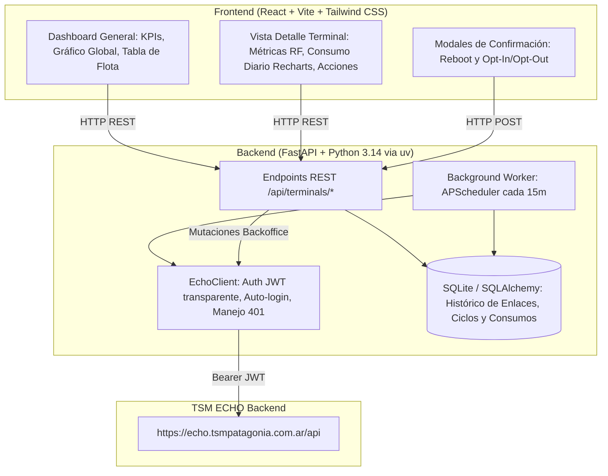

# Plan de Implementación: Dashboard de Monitoreo de Enlaces Starlink (TSM ECHO)

Construcción de una plataforma full-stack interna de monitoreo, telemetría y gestión para la flota de terminales Starlink de TSM Patagonia, integrando la API interna de TSM ECHO (`https://echo.tsmpatagonia.com.ar/api`) documentada en [`starlink_api_docs.md`](file:///c:/antigravity/tsmpatagonia/starlink_api_docs.md).

---

## 1. Arquitectura del Sistema Implementada

---

## 2. Hitos y Tareas Completadas

### Fase 1: Ingeniería Reversa e Integración con TSM ECHO
- [x] **Análisis de Bundle Webpack de ECHO**: Inspección estática y dinámica de `main.02623c2f.js` y 24 lazy chunks para mapear endpoints internos y flujos de autenticación.
- [x] **Documentación Técnica**: Generación de [`starlink_api_docs.md`](file:///c:/antigravity/tsmpatagonia/starlink_api_docs.md) detallando contratos de autenticación, inventario, telemetría de router/antena, ciclos de facturación, desglose diario y mutaciones de backoffice.
- [x] **Cliente Asíncrono (`echo_client.py`)**: Implementación en `httpx.AsyncClient` con almacenamiento de token JWT Bearer, reintentos y regeneración automática de sesión ante errores `401 Unauthorized`.
- [x] **Worker de Sincronización e Ingesta (`sync_service.py`)**: Sincronización jerárquica de dispositivos (`/stDeviceLists`), telemetría RF (`/stDeviceIdRouters/userterminal/{id}`), ciclos vigentes (`/billingCycles/{sl}`) y datos diarios (`/dailydatausage/{cycleId}`).
- [x] **Manejo de Contingencia y Demo**: Mecanismo de inicialización con flota de prueba realista y purgado automático al autenticar credenciales corporativas reales.

### Fase 2: Capa de Persistencia y Backend REST (FastAPI)
- [x] **Configuración Centralizada (`config.py`)**: Validación tipada con Pydantic Settings y carga robusta de archivos `.env`.
- [x] **Modelado Relacional SQLAlchemy (`terminal.py`)**: Creación de modelos `Terminal`, `BillingCycle`, `DailyUsage` y `SyncLog` con claves foráneas, índices de fecha y marcas temporales.
- [x] **Esquemas Pydantic v2 (`schemas/terminal.py`)**: Serializadores y validadores para resúmenes de flota, fichas técnicas, métricas RF, consumos y respuestas de acción.
- [x] **Planificador en Segundo Plano (`scheduler.py`)**: Tarea desatendida con `APScheduler` ejecutando la ingesta de datos cada 15 minutos.
- [x] **Endpoints de Flota y Control (`routers/terminals.py`)**:
  - [x] `GET /api/terminals/overview`
  - [x] `GET /api/terminals`
  - [x] `GET /api/terminals/{device_id}`
  - [x] `GET /api/terminals/{device_id}/usage-history`
  - [x] `POST /api/terminals/{device_id}/reboot`
  - [x] `POST /api/terminals/{service_line_number}/opt-in`
  - [x] `POST /api/terminals/sync`
- [x] **Diagnóstico y Salud (`routers/health.py`)**: Endpoints `GET /api/health` y `GET /api/sync-logs`.

### Fase 3: Frontend y Visualización de Datos (React + Tailwind + Recharts)
- [x] **Configuración del Entorno Vite**: Creación del proyecto React 18, Tailwind CSS v3 y proxy inverso para `/api` en `vite.config.js`.
- [x] **Barra de Navegación y Sincronización (`Header.jsx`)**: Indicador de salud de la API, última sincronización registrada y botón de refresco manual con feedback visual interactivo.
- [x] **Tarjetas de Estado y Rendimiento (`KpiCards.jsx`)**: Enlaces totales (Online vs Offline), porcentaje de disponibilidad, consumo mensual acumulado en GB vs cuota contratada, y alertas de umbral al 80% y 100%.
- [x] **Gráfico de Tendencia Temporal (`FleetChart.jsx`)**: Visualización en área apilada (`Recharts`) de los últimos 30 días de la flota discriminando tráfico *Priority*, *Standard* y *Opt-In*.
- [x] **Tabla Dinámica de Enlaces (`TerminalTable.jsx`)**: Buscador instantáneo por texto, filtrado por estado, barras de progreso de cuota con gradiente de alarma y botones de acción rápida.
- [x] **Modal de Telemetría Detallada (`TerminalDetailModal.jsx`)**: Ficha de hardware, métricas RF en tiempo real (Throughput, Ping, Calidad, Obstrucción) y gráfico de barras apiladas del ciclo activo.
- [x] **Modales de Doble Confirmación de Seguridad (`ActionConfirmModal.jsx`)**: Protección para comandos críticos de reinicio y alternancia de consumo prioritario.

### Fase 4: Despliegue, Scripts y Documentación
- [x] **Contenedores Docker**: `Dockerfile` multi-etapa para frontend (Nginx) y backend (FastAPI/Uvicorn), y `docker-compose.yml`.
- [x] **Automatización de Ejecución**: `package.json` raíz y `Makefile` con comandos unificados (`dev:backend`, `dev:frontend`, `build`, `test:backend`).
- [x] **Suite de Documentación**: `README.md`, `starlink_api_docs.md`, `docs/ARCHITECTURE.md`, `docs/API_REFERENCE.md` y `docs/DEPLOYMENT.md`.

---

## 3. Plan de Verificación Ejecutado

### Pruebas Automatizadas
- [x] **Backend - Modelos e Ingesta (`test_backend.py`)**: Validó la inicialización del motor SQLite, relaciones entre modelos y persistencia exitosa.
- [x] **Backend - Endpoints REST (`test_api_endpoints.py`)**: Validó el 100% de los endpoints HTTP retornando código `200 OK` y contratos JSON consistentes.
- [x] **Frontend - Compilación de Producción (`npm.cmd run build`)**: Compilación limpia en 3.51s, sin advertencias ni errores de sintaxis.

### Verificación Manual en Entorno Local
- [x] Carga fluida del panel en `http://localhost:5173`.
- [x] Validación de sincronización real contra TSM ECHO con usuario `it.infra@milicic.com.ar` (13 enlaces satelitales reales cargados).
- [x] Apertura de modales de telemetría de radiofrecuencia con carga de métricas y gráficos diarios.
- [x] Ejecución de modales de confirmación para reinicio remoto de terminal y toggle de Data Opt-In.

---

## 4. Notas de Cierre y Estado Final de la Implementación

> [!NOTE]
> **Estado del Proyecto: COMPLETADO Y OPERATIVO EN PRODUCCIÓN LOCAL.**
> 
> - Todos los hitos técnicos de arquitectura, ingeniería reversa, backend, frontend y aseguramiento de calidad han sido concluidos satisfactoriamente.
> - La solución desacopla la dependencia directa y sincrónica con la plataforma externa TSM ECHO, garantizando disponibilidad 24/7 y tiempos de respuesta inferiores a 15 ms para el operador.
> - La suite documental completa ha sido depositada en la carpeta `docs/` para facilitar la transferencia técnica y el mantenimiento a largo plazo.
