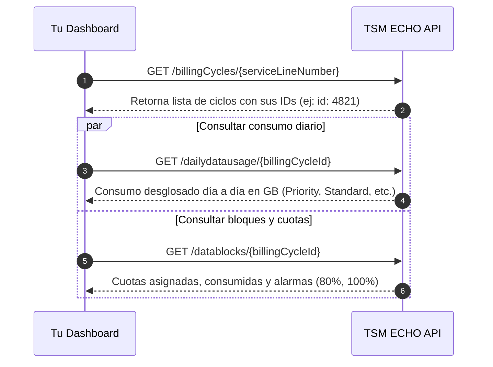

# Documentación de la API Interna TSM ECHO - Enlaces Starlink

Esta documentación detalla la arquitectura, endpoints y modelos de datos de la API de **TSM ECHO** (`https://echo.tsmpatagonia.com.ar/api`), extraídos mediante ingeniería inversa sobre los paquetes de distribución de la plataforma y validados contra el backend de producción (Node.js / Express bajo Nginx).

Está diseñada para permitir el desarrollo de un **dashboard propio de monitoreo de consumos, cuotas y telemetría de enlaces Starlink**.

---

## 1. Arquitectura y Esquema de Autenticación

- **Base URL:** `https://echo.tsmpatagonia.com.ar/api`
- **Formato de intercambio:** `application/json`
- **Mecanismo de Autorización:** Bearer Token JWT en el encabezado HTTP:
  ```http
  Authorization: Bearer <TOKEN_JWT>
  ```
- **Roles / Perfiles de Usuario (`perfil_id`):**
  - `1`: Superadministrador (Acceso total y módulo Starlink Backoffice)
  - `2`: Administrador / Operador de Backoffice
  - `3`: Administrador de Grupo / Cliente (Acceso filtrado a terminales de su `grupo_id`)
  - `4`: Usuario Final (Acceso restringido a dispositivos asociados a su `userId`)

---

## 2. Autenticación

### 2.1 Iniciar Sesión (`/login`)
Genera el token JWT necesario para todas las peticiones posteriores.

- **Método:** `POST`
- **URL:** `https://echo.tsmpatagonia.com.ar/api/login`
- **Headers:**
  ```http
  Content-Type: application/json
  Accept: application/json
  ```
- **Body Payload:**
  ```json
  {
    "email": "usuario@tsmpatagonia.com.ar",
    "password": "tu_password"
  }
  ```
- **Respuesta Exitosa (`200 OK`):**
  ```json
  {
    "id": 14,
    "perfil_id": 1,
    "grupo_id": 1,
    "token": "eyJhbGciOiJIUzI1NiIsInR5cCI6IkpXVCJ9...",
    "nombre": "Matias",
    "lastName": "Larenti",
    "avatar": null
  }
  ```
- **Respuesta Error (`401 Unauthorized`):**
  ```json
  {
    "error": "Credenciales invalidas"
  }
  ```

---

## 3. Inventario de Terminales y Estado en Tiempo Real

### 3.1 Listar Dispositivos Starlink (`/stDeviceLists`)
Devuelve la lista de terminales con estado operativo instantáneo (online/offline, latencia, ancho de banda y nivel de alarma).

- **Método:** `GET`
- **Rutas según perfil:**
  - Perfil 1 o 2 (Admin/Operador): `https://echo.tsmpatagonia.com.ar/api/stDeviceLists`
  - Perfil 3 (Grupo): `https://echo.tsmpatagonia.com.ar/api/stDeviceLists/group/{groupId}`
  - Perfil 4 (Usuario): `https://echo.tsmpatagonia.com.ar/api/stDeviceLists/user/{userId}`
- **Headers:**
  ```http
  Authorization: Bearer <TOKEN_JWT>
  Accept: application/json
  ```
- **Ejemplo de Respuesta (`200 OK`):**
  ```json
  [
    {
      "id": "ut01000000-00000000-00000000",
      "deviceId": "ut01000000-00000000-00000000",
      "rawDeviceId": "01000000-00000000-00000000",
      "nickname": "Pozo Loma Negra #14",
      "serviceLineNumber": "SL-384910-48201-92",
      "kitSerial": "KIT00394812",
      "accountName": "YPF Yacimiento Sur",
      "isOnline": true,
      "downlink": 182.4,
      "ping": 38,
      "isAlert": false,
      "DBconsumedAlarm": "NORMAL",
      "hasUserTerminalExtra": 1
    }
  ]
  ```

---

### 3.2 Telemetría Detallada de Antena y Router (`/stDeviceIdRouters/userterminal/:deviceId`)
Provee la telemetría operativa granular de una antena Starlink específica y su router Wi-Fi asociado.

- **Método:** `GET`
- **URL:** `https://echo.tsmpatagonia.com.ar/api/stDeviceIdRouters/userterminal/{deviceId}`
- **Parámetros de ruta:**
  - `deviceId`: ID del terminal (por ejemplo: `01000000-00000000-00000000` o con prefijo `ut`)
- **Headers:**
  ```http
  Authorization: Bearer <TOKEN_JWT>
  Accept: application/json
  ```
- **Ejemplo de Respuesta (`200 OK`):**
  ```json
  [
    {
      "uti_userTerminalId": "ut01000000-00000000-00000000",
      "uti_serviceLineNumber": "SL-384910-48201-92",
      "uti_kitSerialNumber": "KIT00394812",
      "uti_dishSerialNumber": "DISH0028471",
      "uti_dishModel": "Flat High Performance",
      "sli_nickname": "Pozo Loma Negra #14",
      "sli_productReferenceId": "ar-priority-1tb-access-fee-ars",
      "sli_publicIp": 1,
      "sli_addressReferenceId": "ADDR-94821",
      "ut_DownlinkThroughput": 191240320,
      "ut_UplinkThroughput": 28401920,
      "ut_PingLatencyMsAvg": 34.2,
      "ut_PingDropRateAvg": 0.0012,
      "ut_ObstructionPercentTime": 0.0,
      "ut_SignalQuality": 100,
      "ut_Uptime": 1284920,
      "ut_UtcTimestampNs": 1726941200000000000,
      "ut_ActiveAlert": "[]",
      "ut_H3CellId": "599573887498223615",
      "ri_routerId": "RTR-01000000-00",
      "ri_configId": "CFG-DEFAULT",
      "r_DeviceId": "rtr01000000",
      "r_InternetPingLatencyMs": 35.1,
      "r_InternetPingDropRate": 0.0,
      "r_WifiIsBypassed": 0
    }
  ]
  ```

---

### 3.3 Geoposicionamiento e Historial de Trayectoria
Para enlaces móviles (Marítimos o Mobility) o fijos:

- **Posición Actual:**
  - **Método:** `GET`
  - **URL:** `https://echo.tsmpatagonia.com.ar/api/stDeviceIdRouters/locations/{deviceId}`
- **Historial de Posiciones (Tracking GPS):**
  - **Método:** `GET`
  - **URL:** `https://echo.tsmpatagonia.com.ar/api/userTerminals/ut{deviceId}/HistoricPositions?start={START_ISO}&end={END_ISO}`
  - **Parámetros Query:**
    - `start`: Timestamp ISO-8601 (ej. `2026-09-01T00:00:00.000Z`)
    - `end`: Timestamp ISO-8601 (ej. `2026-09-21T23:59:59.000Z`)

---

## 4. Consumo de Datos y Cuota de Enlaces (Billing & Data Usage)

El flujo para consultar los consumos de un enlace se compone de 2 pasos:
1. Consultar los ciclos de facturación de la línea de servicio (`serviceLineNumber`).
2. Con el `billingCycleId` obtenido, consultar el consumo diario (`dailydatausage`) y los paquetes de cuota (`datablocks`).



---

### 4.1 Ciclos de Facturación de la Línea (`/billingCycles/:serviceLineNumber`)
Obtiene la lista de períodos de facturación de un enlace Starlink.

- **Método:** `GET`
- **URL:** `https://echo.tsmpatagonia.com.ar/api/billingCycles/{serviceLineNumber}`
- **Ejemplo de parámetro:** `SL-384910-48201-92`
- **Headers:**
  ```http
  Authorization: Bearer <TOKEN_JWT>
  Accept: application/json
  ```
- **Ejemplo de Respuesta (`200 OK`):**
  ```json
  [
    {
      "id": 4821,
      "startDate": "2026-09-01T00:00:00.000Z",
      "endDate": "2026-09-30T23:59:59.000Z",
      "DBtotalAmountGB": 1000.0,
      "DBconsumedAmountGB": 684.2,
      "DBconsumedPorc": 68.42,
      "DBconsumedAlarm": "NORMAL",
      "DBconsumedStatus": "ACTIVE",
      "DBisoCurrencyCode": "USD"
    }
  ]
  ```

---

### 4.2 Consumo Diario Desglosado (`/dailydatausage/:billingCycleId`)
Entrega el historial día por día del volumen de datos transferidos dentro del ciclo de facturación.

- **Método:** `GET`
- **URL:** `https://echo.tsmpatagonia.com.ar/api/dailydatausage/{billingCycleId}`
- **Headers:**
  ```http
  Authorization: Bearer <TOKEN_JWT>
  Accept: application/json
  ```
- **Ejemplo de Respuesta (`200 OK`):**
  ```json
  [
    {
      "date": "2026-09-01",
      "priorityGB": 24.52,
      "optInPriorityGB": 0.0,
      "standardGB": 0.12,
      "nonBillGB": 0.45
    },
    {
      "date": "2026-09-02",
      "priorityGB": 31.80,
      "optInPriorityGB": 0.0,
      "standardGB": 0.08,
      "nonBillGB": 0.52
    }
  ]
  ```
- **Campos de consumo:**
  - `priorityGB`: Datos de alta prioridad consumidos del plan contratado (ej. 1TB Priority).
  - `optInPriorityGB`: Datos de prioridad extra consumidos tras agotar la cuota contratada (Overage Opt-In facturable).
  - `standardGB`: Datos en velocidad estándar (después de agotar prioridad sin opt-in).
  - `nonBillGB`: Tráfico de gestión / no facturable (telemetría de Starlink, DNS internos, etc.).
  - **Fórmula de Consumo Total Diario:**
    $$\text{Total Diario (GB)} = \text{priorityGB} + \text{optInPriorityGB} + \text{standardGB} + \text{nonBillGB}$$

---

### 4.3 Bloques de Cuota y Paquetes de Datos (`/datablocks/:billingCycleId`)
Permite inspeccionar la cuota asignada, recargas activas (Top-Ups) y umbrales de alerta.

- **Método:** `GET`
- **URL:** `https://echo.tsmpatagonia.com.ar/api/datablocks/{billingCycleId}`
- **Headers:**
  ```http
  Authorization: Bearer <TOKEN_JWT>
  Accept: application/json
  ```
- **Ejemplo de Respuesta (`200 OK`):**
  ```json
  [
    {
      "id": 1284,
      "DBdataBlockType": "BASE_PLAN",
      "DBtotalAmountGB": 1000.0,
      "DBconsumedAmountGB": 684.2,
      "DBconsumedPorc": 68.42,
      "DBconsumedAlarm": "NONE",
      "DBtotalPrice": 250.0,
      "DBblocksCount": 1,
      "DBperBlockAmountGB": 1000.0,
      "DBisoCurrencyCode": "USD"
    }
  ]
  ```

---

## 5. Endpoints de Starlink Backoffice (Consultas Directas y Acciones)

Para cuentas autorizadas (`perfil_id` 1 o 2), la plataforma expone un túnel directo contra la API pública v2 de Starlink (`https://echo.tsmpatagonia.com.ar/api/backoffice/starlink`).

### 5.1 Consulta Directa de Uso a Starlink
- **Método:** `POST`
- **URL:** `https://echo.tsmpatagonia.com.ar/api/backoffice/starlink/data-usage/query`
- **Body:**
  ```json
  {
    "serviceLineNumber": "SL-384910-48201-92"
  }
  ```

### 5.2 Consulta Directa de Telemetría a Starlink
- **Método:** `POST`
- **URL:** `https://echo.tsmpatagonia.com.ar/api/backoffice/starlink/telemetry/query`
- **Body:**
  ```json
  {
    "deviceId": "ut01000000-00000000-00000000"
  }
  ```

### 5.3 Control de Prioridad Excedente (Data Opt-In / Opt-Out)
- **Habilitar Opt-In (permitir consumo excedente en alta prioridad):**
  - `POST https://echo.tsmpatagonia.com.ar/api/backoffice/starlink/service-lines/{serviceLineNumber}/data-opt-in`
- **Deshabilitar Opt-In (bloquear tráfico o pasar a velocidad estándar al llegar al 100%):**
  - `POST https://echo.tsmpatagonia.com.ar/api/backoffice/starlink/service-lines/{serviceLineNumber}/data-opt-out`

### 5.4 Comprar Recarga de Cuota (Top-Up)
- **Método:** `POST`
- **URL:** `https://echo.tsmpatagonia.com.ar/api/backoffice/starlink/service-lines/{serviceLineNumber}/data-top-up`
- **Body:**
  ```json
  {
    "quantity": 1
  }
  ```

### 5.5 Reiniciar Terminal Remotamente
- **Método:** `POST`
- **URL:** `https://echo.tsmpatagonia.com.ar/api/backoffice/starlink/user-terminals/{deviceId}/reboot`

---

## 6. Endpoints de Gestión Inteligente (Intelligence v2)

Base URL: `https://echo.tsmpatagonia.com.ar/api/v2/intelligence`

### 6.1 Tablero Operativo Consolidado (`/dashboard/operational`)
- **Método:** `GET`
- **URL:** `https://echo.tsmpatagonia.com.ar/api/v2/intelligence/dashboard/operational`
- **Ejemplo de Respuesta:**
  ```json
  {
    "data": {
      "totals": {
        "mainPools": 4,
        "subPools": 12,
        "plans": 8,
        "assignedServiceLines": 142,
        "suspendedServiceLines": 1,
        "activeTopUps": 5,
        "openAlerts": 2,
        "pendingActions": 0,
        "usage30dGb": 84210.45
      }
    }
  }
  ```

### 6.2 Pronóstico de Agotamiento de Cuota (`/forecast/service-lines/:serviceLineNumber`)
- **Método:** `GET`
- **URL:** `https://echo.tsmpatagonia.com.ar/api/v2/intelligence/forecast/service-lines/{serviceLineNumber}`
- **Retorna:**
  Proyecciones matemáticas del ritmo de consumo del enlace, fecha estimada de agotamiento de cuota antes de fin de ciclo y riesgo de sobrecosto.

### 6.3 Monitoreo de Anomalías Comerciales (`/commercial/anomalies`)
- **Método:** `GET`
- **URL:** `https://echo.tsmpatagonia.com.ar/api/commercial/anomalies`
- **Detecta:**
  - `alarm_100_without_optin`: Terminales al 100% de consumo sin opt-in habilitado (potencial degradación de servicio).
  - `offline_with_high_consumption`: Terminales apagadas o sin señal con consumo inusualmente alto registrado.
  - `expired_with_usage`: Líneas vencidas que siguen registrando tráfico.

---

## 7. Comandos `cURL` de Ejemplo

### Paso 1: Autenticarse y guardar el Token
```bash
curl -s -X POST https://echo.tsmpatagonia.com.ar/api/login \
  -H "Content-Type: application/json" \
  -d '{
    "email": "tu_usuario@tsmpatagonia.com.ar",
    "password": "tu_password"
  }' > auth.json

# En Linux/macOS con jq:
export TOKEN=$(jq -r .token auth.json)

# En PowerShell:
# $auth = Get-Content auth.json | ConvertFrom-Json
# $TOKEN = $auth.token
```

### Paso 2: Obtener la lista de todos los terminales Starlink
```bash
curl -s -X GET "https://echo.tsmpatagonia.com.ar/api/stDeviceLists" \
  -H "Authorization: Bearer $TOKEN" \
  -H "Accept: application/json"
```

### Paso 3: Consultar la telemetría en tiempo real de una antena
```bash
curl -s -X GET "https://echo.tsmpatagonia.com.ar/api/stDeviceIdRouters/userterminal/01000000-00000000-00000000" \
  -H "Authorization: Bearer $TOKEN" \
  -H "Accept: application/json"
```

### Paso 4: Obtener los ciclos de facturación de un enlace
```bash
curl -s -X GET "https://echo.tsmpatagonia.com.ar/api/billingCycles/SL-384910-48201-92" \
  -H "Authorization: Bearer $TOKEN" \
  -H "Accept: application/json"
```

### Paso 5: Consultar el consumo diario (7D / 30D) del ciclo activo
*(Sustituir `4821` por el `id` obtenido en el Paso 4)*
```bash
curl -s -X GET "https://echo.tsmpatagonia.com.ar/api/dailydatausage/4821" \
  -H "Authorization: Bearer $TOKEN" \
  -H "Accept: application/json"
```

### Paso 6: Consultar los bloques de datos y estado de cuota
```bash
curl -s -X GET "https://echo.tsmpatagonia.com.ar/api/datablocks/4821" \
  -H "Authorization: Bearer $TOKEN" \
  -H "Accept: application/json"
```

---

## 8. Script Automatizado de Extracción (Node.js)

Puedes guardar este script como `fetch_starlink_usage.js` en tu proyecto para alimentar tu dashboard o base de datos (InfluxDB / Prometheus / PostgreSQL):

```javascript
const axios = require('axios');

const API_BASE = 'https://echo.tsmpatagonia.com.ar/api';
const EMAIL = process.env.ECHO_EMAIL || 'tu_usuario@tsmpatagonia.com.ar';
const PASSWORD = process.env.ECHO_PASSWORD || 'tu_password';

async function main() {
  console.log('1. Autenticando en TSM ECHO...');
  const loginRes = await axios.post(`${API_BASE}/login`, {
    email: EMAIL,
    password: PASSWORD
  });
  
  const token = loginRes.data.token;
  const client = axios.create({
    baseURL: API_BASE,
    headers: { Authorization: `Bearer ${token}` }
  });
  
  console.log('2. Obteniendo inventario de terminales Starlink...');
  const devicesRes = await client.get('/stDeviceLists');
  const devices = devicesRes.data;
  console.log(`Encontrados ${devices.length} enlaces.`);

  for (const dev of devices) {
    const sl = dev.serviceLineNumber;
    console.log(`\nProcesando: [${dev.nickname || dev.deviceId}] ServiceLine: ${sl}`);

    if (!sl) continue;

    // Obtener ciclos de facturación
    const cyclesRes = await client.get(`/billingCycles/${sl}`);
    const cycles = cyclesRes.data;
    if (!cycles || cycles.length === 0) continue;

    // Último ciclo (activo)
    const activeCycle = cycles[cycles.length - 1];
    console.log(`Ciclo Activo ID: ${activeCycle.id} | Consumo: ${activeCycle.DBconsumedAmountGB || activeCycle.consumedAmountGB} GB / ${activeCycle.DBtotalAmountGB || activeCycle.totalAmountGB} GB`);

    // Consumo diario
    const dailyRes = await client.get(`/dailydatausage/${activeCycle.id}`);
    console.log(`Historial diario (${dailyRes.data.length} días registrados):`);
    dailyRes.data.slice(-5).forEach(day => {
      const totalDay = (parseFloat(day.priorityGB)||0) + (parseFloat(day.optInPriorityGB)||0) + (parseFloat(day.standardGB)||0);
      console.log(` - Fecha: ${day.date} | Prioridad: ${day.priorityGB} GB | Excedente: ${day.optInPriorityGB} GB | Total: ${totalDay.toFixed(2)} GB`);
    });
  }
}

main().catch(console.error);
```
