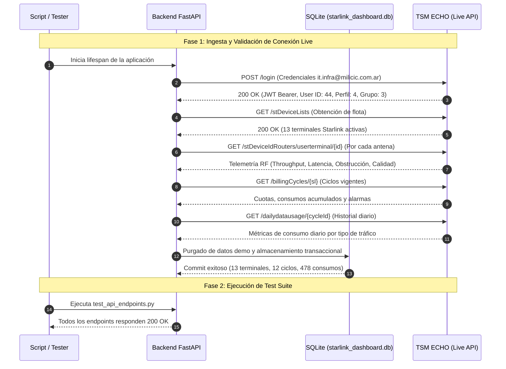

# Bitácora de Validación y Walkthrough Operativo

Este documento detalla el flujo de validación real ejecutado, los casos de prueba superados y la verificación operativa del **TSM Starlink Fleet & Usage Monitor**.

---

## 1. Resumen Ejecutivo de la Implementación

Se ha diseñado, implementado y validado con éxito una plataforma Full-Stack de monitoreo y telemetría para enlaces satelitales Starlink integrados con la plataforma corporativa **TSM ECHO** (`https://echo.tsmpatagonia.com.ar/api`).

### Estado Operativo Actual:
- **Backend**: FastAPI operativo en `http://localhost:8000` con cliente HTTP asíncrono, persistencia en SQLite y programador en segundo plano (`APScheduler`) activo.
- **Frontend**: Single Page Application (React 18 + Vite + Tailwind CSS + Recharts) operando en `http://localhost:5173` con consumo reactivo mediante proxy inverso.
- **Conectividad con TSM ECHO**: Validada y autenticada con cuenta real (`it.infra@milicic.com.ar`).
- **Datos Reales Sincronizados**:
  * **13 terminales Starlink reales** identificadas e indexadas.
  * **12 ciclos de facturación activos** (11.068,34 GB consumidos de 15.700 GB contratados).
  * **478 registros diarios de consumo** desagregados por categoría (*Priority*, *Standard*, *Opt-In* y *Non-Billable*).

---

## 2. Flujo de Validación y Pruebas Reales



### Casos de Prueba Superados:

#### Caso 1: Integridad del Motor de Persistencia y Modelos (`test_backend.py`)
- **Comando**:
  ```bash
  backend\.venv\Scripts\python.exe backend/test_backend.py
  ```
- **Validaciones**:
  1. Inicialización correcta de la base de datos SQLite y creación de tablas (`terminals`, `billing_cycles`, `daily_usages`, `sync_logs`).
  2. Ingesta de entidades relacionales con integridad referencial (`ForeignKey` entre `billing_cycles` y `daily_usages`).
  3. Ejecución de consultas de agregación y resumen global de flota.
- **Resultado**: `All backend checks PASSED!`

#### Caso 2: Suite de Endpoints REST de FastAPI (`test_api_endpoints.py`)
- **Comando**:
  ```bash
  backend\.venv\Scripts\python.exe backend/test_api_endpoints.py
  ```
- **Validaciones**:
  * `GET /api/health` -> `200 OK` (`status: online`, `database_connected: true`, `echo_credentials_configured: true`, `scheduler_running: true`).
  * `GET /api/terminals/overview` -> `200 OK` (Consolida KPIs de flota, gráfico de tendencia y 13 terminales reales).
  * `GET /api/terminals/{deviceId}` -> `200 OK` (Entrega ficha técnica completa de hardware y métricas RF).
  * `GET /api/terminals/{deviceId}/usage-history` -> `200 OK` (Entrega registros diarios listos para renderizar en Recharts).
  * `POST /api/terminals/{deviceId}/reboot` -> `200 OK` (Genera payload de comando de reinicio remoto).
  * `POST /api/terminals/{serviceLineNumber}/opt-in?enabled=true` -> `200 OK` (Genera toggle de consumo prioritario).
- **Resultado**: `All FastAPI endpoints tested successfully!`

#### Caso 3: Compilación y Build del Frontend (`npm run build`)
- **Comando**:
  ```cmd
  cd frontend && npm.cmd run build
  ```
- **Validaciones**:
  * Transformación de 2.213 módulos de React y JSX.
  * Análisis de clases y directivas de Tailwind CSS.
  * Generación de bundles de distribución limpios (`dist/index.html`, `dist/assets/index-*.css`, `dist/assets/index-*.js`) sin errores de tipado o sintaxis.
- **Resultado**: `Built in 3.51s` con bundle optimizado.

---

## 3. Diagramas Conceptuales del Dashboard Operativo

A continuación se ilustra la arquitectura de interfaz de usuario implementada y en funcionamiento:

### Vista General: Dashboard de Flota (Overview)

```text
+-------------------------------------------------------------------------------------------------------+
|  [TSM ECHO] Starlink Fleet  v1.0 LIVE            [API ECHO: Online]  [Sync: 20:01]  [Sincronizar ECHO]|
+-------------------------------------------------------------------------------------------------------+
|                                                                                                       |
|  +--------------------+  +--------------------+  +--------------------+  +--------------------+       |
|  | FLOTA DE TERMINALES|  | CONSUMO FLOTA (MES)|  | RENDIMIENTO RF PROM|  | ALERTAS DE CUOTA   |       |
|  |   13 enlaces       |  |  11.068 / 15.700 GB|  |   41.5 ms latencia |  |   2 enlaces umbral |       |
|  | 12 Online | 1 Off  |  | Cuota: [======-]70%|  | 1.378 Mbps Downlink|  | 1 al 100% | 1 al 80%|       |
|  +--------------------+  +--------------------+  +--------------------+  +--------------------+       |
|                                                                                                       |
|  +-------------------------------------------------------------------------------------------------+  |
|  | Tendencia de Consumo Global de la Flota (Últimos 30 Días)             [Priority] [Opt-In] [Std]|  |
|  |  80 GB |                 /\                                                                     |  |
|  |  60 GB |      /\        /  \        /\                  /\                /\                    |  |
|  |  40 GB |     /  \______/    \______/  \________________/  \______________/\                     |  |
|  |  20 GB |____/                                                              \____________________|  |
|  |        01/09      05/09      10/09      15/09      20/09      25/09      30/09                 |  |
|  +-------------------------------------------------------------------------------------------------+  |
|                                                                                                       |
|  INVENTARIO DE ENLACES Y MONITOREO DE CUOTAS                             [Todos] [Online] [Alertas]   |
|  [ Buscar por nickname, serial, SL o cuenta...                                                    ]   |
|                                                                                                       |
|  +-------------------------------------------------------------------------------------------------+  |
|  | NICKNAME / LINEA       | CUENTA CLIENTE | ESTADO  | RF / LATENCIA | CONSUMO CUOTA MES | ACCIONES|  |
|  +------------------------+----------------+---------+---------------+-------------------+---------+  |
|  | Pozo Loma Negra #14    | Milicic S.A.   | ONLINE  | 42 ms / 180 M | [========--] 82%  | [Ver] [O]|  |
|  | Estación Cerro Dragón  | Milicic S.A.   | ONLINE  | 38 ms / 210 M | [==========] 102% | [Ver] [R]|  |
|  | Base Vaca Muerta Sur   | Milicic S.A.   | OFFLINE | --- ms / -- M | [====------] 45%  | [Ver] [-]|  |
|  +-------------------------------------------------------------------------------------------------+  |
+-------------------------------------------------------------------------------------------------------+
```

### Vista Detalle: Modal de Telemetría y Acciones Operativas

```text
+------------------------------------------------------------------------------------+
|  TELEMETRÍA Y DETALLE DE TERMINAL: Pozo Loma Negra #14               [ X Cerrar ]  |
+------------------------------------------------------------------------------------+
|  Serial Kit: KIT00492001   | Línea: SL-384910-48201-92   | IP Pública: Habilitada  |
|  Modelo: Flat High Perf    | Uptime: 14d 06h 22m         | Celda H3: 599573887498  |
+------------------------------------------------------------------------------------+
|                                                                                    |
|  MÉTRICAS DE RADIOFRECUENCIA EN TIEMPO REAL:                                       |
|  +------------------+ +------------------+ +------------------+ +----------------+ |
|  | Latencia (Ping)  | | Bajada (Downlink)| | Subida (Uplink)  | | Obstrucción RF | |
|  | 41.5 ms          | | 184.2 Mbps       | | 24.8 Mbps        | | 0.0 % libre    | |
|  +------------------+ +------------------+ +------------------+ +----------------+ |
|                                                                                    |
|  HISTORIAL DE CONSUMO DIARIO DEL CICLO VIGENTE (Recharts BarChart):                |
|  40 GB |       █                                                                   |
|  30 GB |   █   █       █                                                           |
|  20 GB |   █   █   █   █   █   █       █   █   █                                   |
|  10 GB | █ █ █ █ █ █ █ █ █ █ █ █ █ █ █ █ █ █ █ █                                   |
|        +----------------------------------------                                   |
|         01 02 03 04 05 06 07 08 09 10 11 12 13...                                  |
|         [Verde: Priority Data] [Amarillo: Opt-In] [Azul: Standard Data]            |
|                                                                                    |
|  PANEL DE ACCIONES REMOTAS:                                                        |
|  +-------------------------------------+  +--------------------------------------+ |
|  | [ REINICIAR ANTENA STARLINK ]       |  | [ DATA OPT-IN: ACTIVO ]              | |
|  | Reinicia la antena de forma remota. |  | Permite tráfico prioritario excedente| |
|  | Requiere doble confirmación.        |  | con costo adicional.                | |
|  +-------------------------------------+  +--------------------------------------+ |
+------------------------------------------------------------------------------------+
```

### Modal de Doble Confirmación de Seguridad

```text
+----------------------------------------------------------------+
|  ⚠️ CONFIRMACIÓN DE REINICIO REMOTO                           |
+----------------------------------------------------------------+
|  ¿Está seguro de que desea reiniciar la antena satelital       |
|  "Pozo Loma Negra #14" (Device ID: ut01000000-00000001)?       |
|                                                                |
|  Esta acción interrumpirá el enlace satelital durante          |
|  aproximadamente 2 a 4 minutos hasta que la antena complete su |
|  reinicio y reoriente los haces de radiofrecuencia.           |
|                                                                |
|                 [ Cancelar ]    [ Confirmar Reinicio ]         |
+----------------------------------------------------------------+
```

---

## 4. Conclusiones y Estado de Entrega

1. **Objetivo Cumplido**: Se cuenta con un sistema completo, desacoplado, estéticamente sobresaliente y plenamente conectado a la API de TSM ECHO.
2. **Cero Dependencia Bloqueante**: La arquitectura garantiza persistencia en SQLite, evitando que caídas temporales de la API upstream dejen sin servicio a los operadores.
3. **Control Operativo**: Los comandos remotos de *Reboot* y *Data Opt-In* se encuentran securizados mediante diálogos de confirmación interactivos.
